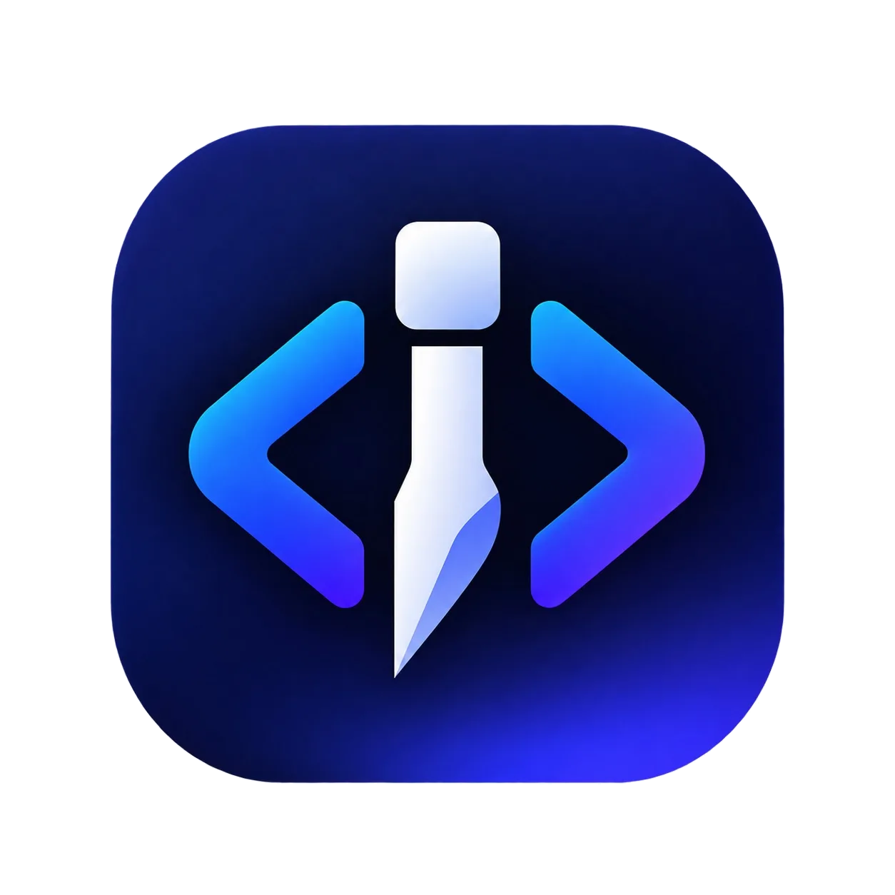

# ChiselCode

<p align="center">
  
</p>

**ChiselCode** — безопасный помощник для работы с кодом. Он читает и объясняет проект, ищет ошибки и по вашему подтверждению меняет файлы. Работает в папке вашего проекта и не трогает файлы вне неё.

## Самый простой старт в Windows

1. На странице [Releases](https://github.com/TheAsrada/ChiselCode/releases) скачайте `ChiselCode-Setup-<версия>.exe` и запустите. Права администратора не нужны: установщик положит `chisel` в `%LOCALAPPDATA%\ChiselCode`, добавит его в PATH и создаст ярлык в меню «Пуск». На странице компонентов можно дополнительно включить ярлык на рабочем столе.
2. Откройте PowerShell **в любом месте** (папка проекта не обязательна) и запустите:

```powershell
chisel
```

3. При первом запуске откроется короткая настройка. Нажмите `1`, `2`, `3` или `4`, вставьте API-ключ, при необходимости укажите адрес API и модель. Ключ скрыт на экране и сохраняется локально в зашифрованном виде.
4. Укажите папку проекта прямо в чате (можно также путь к файлу — возьмётся его папка):

```text
/cwd C:\path\to\project
```

5. После этого напишите обычную задачу, например:

```text
Объясни структуру этого проекта
```

или:

```text
Найди ошибки TypeScript и предложи исправление
```

Нажмите **Enter**. Когда помощник захочет изменить файл или выполнить команду, он покажет, что именно будет сделано. Нажмите **y**, чтобы разрешить действие, или **n**, чтобы отклонить. Для выхода нажмите **Ctrl+C**.

> Windows может показать SmartScreen для нового неподписанного EXE. Скачивайте файл только со страницы официального релиза выше.

## Установка на macOS и Linux

В релизах лежат только установщики (отдельные бинарники не публикуются).

**macOS** — скачайте `ChiselCode-Setup-<версия>-macos-arm64.pkg` (Apple Silicon) или `...-macos-x64.pkg` (Intel) и откройте двойным кликом. Установщик положит `chisel` в `/usr/local/bin`. Если Gatekeeper блокирует неподписанный пакет, откройте его через правую кнопку → «Открыть». Удаление: `sudo rm /usr/local/bin/chisel`.

**Linux (Debian/Ubuntu)** — скачайте `ChiselCode-Setup-<версия>-linux-amd64.deb` и поставьте:

```bash
sudo apt install ./ChiselCode-Setup-<версия>-linux-amd64.deb
```

Удаление: `sudo apt remove chiselcode`.

> Без установщика (сборка из исходников): нужен Bun 1.2+, затем `bun build ./src/cli.ts --compile --target=bun-windows-x64 --outfile=chisel.exe` (target под свою ОС).

## Команды и ввод в интерактивном режиме

Интерактивный режим работает как в привычных агентах: обычный текст отправляется помощнику, а короткие команды начинаются с `/`. Начните вводить `/` — появится список с подсказками, Tab или Enter дополняет выбранную команду.

| Команда | Что делает |
| --- | --- |
| `/help` | показать список команд |
| `/clear` | очистить экран (сессия и файлы не затрагиваются) |
| `/cwd <путь>` | сменить папку проекта (можно путь к файлу); без аргументов — показать текущую |
| `/settings` | меню смены сервиса, модели и адреса API |
| `/model` | быстро сменить модель для текущего сеанса |
| `/skills` | скиллы: выбрать и задействовать для сессии |
| `/status` | показать сервис, модель, папку проекта и готовность ключа |
| `/update` | проверить обновление и тихо установить его (перезапуск сам) |
| `/doctor` | проверить настройку без показа ключей |
| `/exit` | закрыть ChiselCode |

### Скиллы

Скилл — это папка с `SKILL.md` (формат открытого стандарта Agent Skills, как в Claude Code): YAML-шапка с `name`/`description` + markdown-инструкции, рядом необязательные `scripts/`, `references/`, `assets/`. Агент читает описания всех скиллов и сам открывает нужный `SKILL.md`, когда задача совпадает; вручную скилл вызывается как `/имя`:

```markdown
---
name: review
description: Ревью незакоммиченных изменений. Используй, когда просят проверить diff или найти баги.
---

Сделай ревью `git diff`: найди баги и нарушения конвенций. Учти:

$ARGUMENTS
```

Читаются откуда (первый найденный побеждает): `.chisel/skills/<имя>/` проекта → `.agents/skills/<имя>/` (общий стандарт, видят и другие агенты) → личная папка → `skills/` рядом с конфигом → встроенные из установщика (`/review`, `/commit`, `/skill-creator`). А сохраняются ВСЕ новые скиллы только в личную папку для всех проектов: `%LOCALAPPDATA%\ChiselCode\skills\<имя>\` (Windows) или `~/.local/share/chiselcode/skills/<имя>/`.

Встроенные команды (`/settings` и др.) перекрыть нельзя. Скилл с `user-invocable: false` во frontmatter не вызывается как команда (как `/skill-creator`), но виден агенту и в `/skills`. В журнале виден короткий `/review args`, выполняются инструкции из `SKILL.md`. Команда `/skills` — мини-меню: выбор задействует скилл для всей сессии (инструкции прикладываются к запросам, `●` — активен), агент и сам открывает скиллы по описанию. Подсказки и `/help` подхватывают новые скиллы сразу.

Управление полем ввода:

- **Enter** — отправить запрос;
- **Shift+Enter** — перенос строки для многострочной задачи;
- **↑ / ↓** — история отправленных запросов;
- **← / →** — перемещение по строке;
- **PageUp / PageDown** — листать историю ответов вверх и вниз без скроллбэка терминала;
- **Home / End** — перейти к началу или концу истории ответов;
- при запросе на изменение файла или команды нажмите **y** (разрешить) или **n**/**Esc** (отклонить).

Настройки сохраняются локально; API-ключ никогда не показывается на экране, в статусе или в сообщениях об ошибке.

## Откуда взять API-ключ

ChiselCode не предоставляет собственную модель: нужен ключ выбранного сервиса.

- **Anthropic (Claude)** — создайте ключ в [Anthropic Console](https://console.anthropic.com/). В мастере выберите `1`.
- **OpenAI** — создайте ключ на [OpenAI Platform](https://platform.openai.com/api-keys). В мастере выберите `2`.
- **AgentRouter** — единый ключ к Claude, GPT, DeepSeek, GLM и другим моделям: регистрация на [agentrouter.org](https://agentrouter.org/register), ключ — [agentrouter.org/console/token](https://agentrouter.org/console/token). В мастере выберите `5`: адрес `https://agentrouter.org/v1` подставится сам, модель укажите из вашей консоли AgentRouter (например `claude-opus-5`) — идентификаторы со временем меняются, кнопка «Проверить подключение» в настройках подскажет, если названия нет в списке шлюза.
- **Anthropic-compatible proxy** — выберите `4`, укажите корень API (например, `https://proxy.example.com`) и модель прокси. Этот режим использует Anthropic Messages API (`/v1/messages`) и Bearer-токен — подходит для прокси, настроенных как Claude Code.
- **Ollama, OpenRouter, Groq, LM Studio или другой OpenAI-совместимый сервис** — выберите `3`, укажите полный адрес API с `/v1` (например `http://localhost:11434/v1`) и имя модели, которое поддерживает ваш сервер.

### Anthropic-compatible proxy

Если API уже работает в Claude Code через `ANTHROPIC_BASE_URL`, в ChiselCode выберите **Anthropic-compatible proxy** (`chisel setup`, вариант `4`). Укажите тот же базовый адрес — **без** добавления `/v1` — и модель, заданную для Claude Code. Например:

```text
Адрес API: https://proxy.example.com
Модель: model-name-from-proxy
```

ChiselCode сам вызывает `/v1/messages` в формате Anthropic и передаёт токен только в заголовке `Authorization: Bearer …`. Для OpenAI-совместимого сервиса, напротив, выберите вариант `3` и укажите базовый адрес с `/v1`, поскольку он использует `/chat/completions`.


```powershell
chisel setup
```

Проверить, всё ли готово, не показывая ключ:

```powershell
chisel doctor
```

Проверить обновление (для скриптов есть `chisel update --json`):

```powershell
chisel update
```

> Без установщика (portable-вариант): соберите EXE из исходников (см. «Установка на macOS и Linux») и вызывайте по полному пути вместо `chisel`.

## Полезные задачи

Пишите задачу так, как написали бы разработчику:

- `Покажи, где реализована авторизация.`
- `Объясни, почему падает этот тест.`
- `Найди неиспользуемый код.`
- `Добавь проверку пустого email, но сначала покажи план.`
- `Исправь ошибку сборки.`

Для разового запуска из PowerShell можно передать задачу сразу (из папки проекта, либо с флагом `--cwd`):

```powershell
chisel "Проверь этот проект на ошибки"
chisel --cwd C:\path\to\project "Проверь этот проект на ошибки"
```

По умолчанию изменения требуют вашего ответа. Флаг `--yes` отключает подтверждения, поэтому используйте его только в доверенном проекте:

```powershell
chisel "Исправь ошибки" --yes
```

## Если что-то не работает

- **Окно сразу закрывается (мигает и исчезает)** — поставьте установщик из релизов и запускайте командой `chisel` из терминала. Начиная с 0.1.8 окно при двойном клике остаётся открытым с подсказкой и ждёт Enter, а `chisel "задача"` работает из кавычек.
- **«Не найден API-ключ»** — запустите `chisel setup` и завершите мастер.
- **Ошибка доступа или модели** — перепроверьте ключ, выбранный сервис и имя модели через `chisel setup`.
- **Локальная модель не отвечает** — убедитесь, что Ollama/LM Studio запущен, и введите полный адрес с `/v1`, например `http://localhost:11434/v1`.
- **Изменение не выполнено** — это нормально, если вы нажали `n` или запускаете одноразовую команду без разрешения. Интерактивный режим показывает вопрос `y/n`.

## Для разработчиков

Исходный код требует Bun 1.2+ и `rg` (ripgrep) для поиска:

```bash
bun install --frozen-lockfile
bun run src/cli.ts
bun run typecheck
bun test
bun run lint
```

### Команды и автоматизация

```text
chisel setup                         пройти настройку
chisel doctor                        проверить настройку без показа ключей
chisel "задача"                       выполнить задачу
--provider anthropic|anthropic-compatible|openai|openai-compatible|agentrouter
--model <model-id>
--base-url <url>
--yes                                разрешить все изменения
--allow write_file,run_shell         разрешить отдельные инструменты
--json                               вывести один JSON-объект
--resume <session-id>                продолжить сессию
--cwd <path>                         корень проекта
```

Для CI переменные окружения имеют приоритет над локально сохранёнными ключами:

```bash
ANTHROPIC_API_KEY=... chisel "Покажи структуру проекта"
OPENAI_API_KEY=... chisel --provider openai "Проверь тесты"
AGENTROUTER_API_KEY=... chisel --provider agentrouter "Проверь тесты"
```

### Безопасность

ChiselCode ограничивает все файловые пути корнем проекта, блокирует ignored paths и защищает от обходов через `..` и симлинки. Существующий файл нужно сначала прочитать перед записью, а `edit_file` требует ровно одно совпадение заменяемой строки. Shell, запись, удаление и Git commit защищены deny-by-default.

Настройки проекта можно задать в `.chiselrc`:

```json
{
  "allowedCommands": ["bun test", "bun run typecheck"],
  "deniedCommands": ["rm -rf", "git push --force"],
  "ignorePatterns": [".git/**", "node_modules/**", ".env"],
  "autoApprove": false
}
```

`CHISEL.md` — Markdown-файл с правилами конкретного проекта; он добавляется к инструкции помощника.

## Вклад, релизы и лицензия

Прочитайте [CONTRIBUTING.md](CONTRIBUTING.md), [SECURITY.md](SECURITY.md) и [CHANGELOG.md](CHANGELOG.md). GitHub Actions проверяет проект на Windows, macOS и Linux, а тег `v*` создаёт Release с standalone-бинарниками для трёх платформ.

[MIT](LICENSE).
