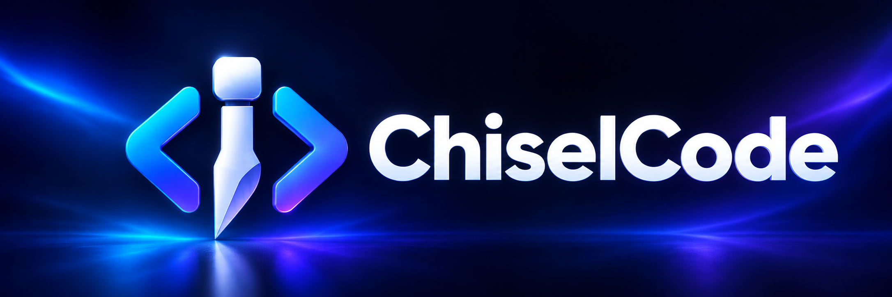

<p align="center">
  
</p>
<p align="center"><strong>От вопроса о коде до проверяемого изменения — прямо в терминале.</strong></p>
<p align="center">Помощник для разработки с несколькими API-провайдерами, историей проектов и просмотром изменений перед подтверждением.</p>
<p align="center">
  <a href="https://github.com/TheAsrada/ChiselCode/actions/workflows/ci.yml"></a>
  <a href="https://github.com/TheAsrada/ChiselCode/releases/latest"></a>
  <a href="LICENSE"></a>
</p>
<p align="center">
  <a href="https://github.com/TheAsrada/ChiselCode/releases/latest">Скачать</a> ·
  <a href="docs/README.md">Документация</a> ·
  <a href="docs/getting-started.md">Быстрый старт</a> ·
  <a href="CONTRIBUTING.md">Участие в проекте</a> ·
  <a href="CHANGELOG.md">История изменений</a>
</p>

## Что умеет ChiselCode

| Понять проект | Внести изменения | Продолжить работу |
| --- | --- | --- |
| Читать файлы, искать код, объяснять ошибки и структуру | Показывать diff, редактировать файлы и запускать команды с подтверждением | Сохранять разговоры по проектам, переключать модели и подключать навыки |

Поддерживаются **Anthropic**, **OpenAI**, **AgentRouter**, **OpenAI-compatible** и **Anthropic-compatible** API. Нужен собственный ключ сервиса и доступная в нём модель; ChiselCode не предоставляет модель или API-кредиты.

## Быстрый старт

1. Скачайте установщик со страницы [последнего релиза](https://github.com/TheAsrada/ChiselCode/releases/latest).
2. Откройте новый терминал и выполните `chisel`. При первом запуске выберите провайдера, укажите ключ и модель.
3. Выберите проект командой `/cwd` и напишите задачу:

```text
/cwd "C:\path\to\project"
Объясни структуру проекта и покажи, где запускаются тесты.
```

На macOS/Linux используйте путь вида `/home/user/project`. Когда появится запрос на изменение, изучите diff и нажмите **y** для подтверждения или **n / Esc** для отказа.

| Платформа | Установщик в Releases |
| --- | --- |
| Windows x64 | `ChiselCode-Setup-<версия>.exe` |
| macOS Apple Silicon | `ChiselCode-Setup-<версия>-macos-arm64.pkg` |
| macOS Intel | `ChiselCode-Setup-<версия>-macos-x64.pkg` |
| Linux Debian/Ubuntu x64 | `ChiselCode-Setup-<версия>-linux-amd64.deb` |

Подробности: [установка и обновление](docs/installation.md) · [провайдеры и ключи](docs/providers.md). Для поиска по содержимому нужен `rg` (ripgrep) в PATH; для Git-инструментов — Git.

## Ваш рабочий цикл

```text
Найди причину падающего теста и предложи план исправления.
Внеси минимальное исправление и запусти подходящий тест.
Покажи итоговый diff и объясни, что изменилось.
```

- `/settings` — настройка сервиса и подключения; `/model` — выбор модели.
- `/sessions` — разговоры текущего проекта; `/clear` — сохранить разговор и начать новый.
- `/skills` — навыки; `/help` — все команды.

Для разового запроса:

```bash
chisel --cwd ./my-project "Объясни структуру проекта"
```

Файловые инструменты проверяют границы проекта. Изменения требуют разрешения по умолчанию. Разрешённый shell работает с правами вашего пользователя; это **не системная песочница**. Подробности — в [модели безопасности](docs/security.md).

## Документация

| Начать пользоваться | Настроить под себя | Разрабатывать |
| --- | --- | --- |
| [Первый запуск](docs/getting-started.md) | [Провайдеры](docs/providers.md) | [Разработка](docs/development.md) |
| [Интерфейс и команды](docs/interactive.md) | [Конфигурация](docs/configuration.md) | [Архитектура](docs/architecture.md) |
| [Решение проблем](docs/troubleshooting.md) | [Навыки](docs/skills.md) | [CLI и автоматизация](docs/cli.md) |

Полный указатель, включая сессии и устройство diff: **[docs/README.md](docs/README.md)**.

## Участие в проекте

Баги и предложения: [GitHub Issues](https://github.com/TheAsrada/ChiselCode/issues). Перед первым PR прочитайте [руководство участника](CONTRIBUTING.md); об уязвимостях сообщайте по [Security Policy](SECURITY.md).

ChiselCode распространяется по лицензии [MIT](LICENSE).
