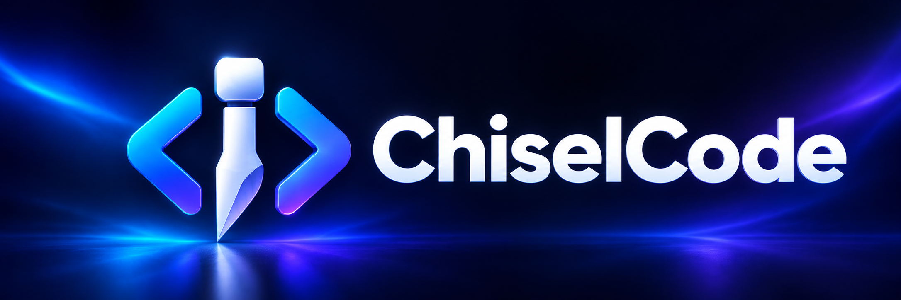

<p align="center">
  
</p>
<p align="center"><strong>От вопроса о коде до проверяемого изменения — прямо в терминале.</strong></p>
<p align="center">Помощник для разработки с несколькими API-провайдерами, историей проектов и просмотром изменений перед подтверждением.</p>
<p align="center">
  <a href="https://github.com/TheAsrada/ChiselCode/actions/workflows/ci.yml"></a>
  <a href="https://github.com/TheAsrada/ChiselCode/releases/latest"></a>
  <a href="LICENSE"></a>
</p>
<p align="center">
  <a href="https://github.com/TheAsrada/ChiselCode/releases/latest">Скачать</a> ·
  <a href="docs/README.md">Документация</a> ·
  <a href="docs/getting-started.md">Быстрый старт</a> ·
  <a href="CONTRIBUTING.md">Участие в проекте</a> ·
  <a href="CHANGELOG.md">История изменений</a>
</p>

## Что умеет ChiselCode

| Понять проект | Внести изменения | Продолжить работу |
| --- | --- | --- |
| Читать файлы, искать код, объяснять ошибки и структуру | Показывать diff, редактировать файлы и запускать команды с подтверждением | Сохранять разговоры по проектам, переключать модели и подключать навыки |

Поддерживаются **Anthropic**, **OpenAI**, **AgentRouter**, **OpenAI-compatible** и **Anthropic-compatible** API. Нужен собственный ключ сервиса и доступная в нём модель; ChiselCode не предоставляет модель или API-кредиты.

Можно настроить несколько **profiles** одного сервиса (`openai-work`, `openai-personal`) через `chisel setup --provider openai --profile openai-work`, затем выбрать `chisel --profile openai-work`. Пользовательские OpenAI/Anthropic-compatible gateways добавляются через declarative `provider.json` без пересборки: [руководство custom providers](docs/custom-providers.md).

MCP-серверы подключаются через `/mcp`: URL или локальная команда, проверка подключения, список tools и отдельные разрешения. Plan допускает консервативно классифицированное внешнее чтение; изменения требуют Build и действующих разрешений. [Подключить MCP](docs/mcp.md).

Агент умеет искать актуальные публичные источники через `web_search` и читать документацию через `web_fetch`, включая Plan. Публичный Web по умолчанию доступен без подтверждений; пользовательские и проектные запреты доменов имеют приоритет. По умолчанию стоит Авто: Exa → Parallel без обязательного API-ключа; сохранённый ключ Brave добавляет его первым. Агент сам выбирает, когда искать и какие источники открыть, затем использует проверенную документацию в работе над кодом. Сервис поиска и сетевые разрешения доступны в `/settings` → Web. Private/reserved адреса и metadata блокируются независимо от Allow и Bypass. [Настроить Web](docs/web.md).

Корпоративные HTTP/HTTPS proxy, дополнительные CA и mTLS поддерживаются для моделей, HTTP MCP и native Web. Сертификаты клиента ограничиваются указанными адресами; proxy-пароль не передаётся сайту. [Настройка корпоративной сети](docs/network.md).

## Быстрый старт

1. Скачайте установщик со страницы [последнего релиза](https://github.com/TheAsrada/ChiselCode/releases/latest).
2. Откройте новый терминал и выполните `chisel`. При первом запуске выберите провайдера, укажите ключ и модель.
3. Выберите проект командой `/cwd` и напишите задачу:

```text
/cwd "C:\path\to\project"
Объясни структуру проекта и покажи, где запускаются тесты.
```

На macOS/Linux используйте путь вида `/home/user/project`. Когда появится запрос на изменение, изучите diff и нажмите **y** для подтверждения или **n / Esc** для отказа.

| Платформа | Установщик в Releases |
| --- | --- |
| Windows x64 | `ChiselCode-Setup-<версия>.exe` |
| macOS Apple Silicon | `ChiselCode-Setup-<версия>-macos-arm64.pkg` |
| macOS Intel | `ChiselCode-Setup-<версия>-macos-x64.pkg` |
| Linux Debian/Ubuntu x64 | `ChiselCode-Setup-<версия>-linux-amd64.deb` |

Подробности: [установка и обновление](docs/installation.md) · [провайдеры и ключи](docs/providers.md). `rg` ускоряет поиск; без него используется встроенный fallback. Для Git-инструментов нужен Git.

## Ваш рабочий цикл

```text
Найди причину падающего теста и предложи план исправления.
Внеси минимальное исправление и запусти подходящий тест.
Покажи итоговый diff и объясни, что изменилось.
```

- `/settings` — popup с разделами «Подключение» и «Оформление». `/model` или нажатие на название модели под вводом открывает отдельный выбор: поиск, профили и ручной ID; Enter или щелчок применяет модель для следующего сообщения в этой сессии. В поддерживающих терминалах `Ctrl+,` открывает настройки.
- Темы Obsidian (чёрная по умолчанию), Graphite, Ember и Paper находятся в настройках. `Ctrl+T` открывает раздел «Оформление»: выбор показывает тему сразу, «Применить тему» сохраняет её, Esc отменяет предпросмотр.
- Стартовый экран — логотип Coder Mini и поле ввода под ним; `/home` или Ctrl+G возвращает к нему.
- **Shift+Tab** в поле ввода переключает **Plan / Build**. Plan изучает проект и составляет план с помощью инструментов чтения; Build выполняет изменения с обычными подтверждениями. Метка режима и выбранная модель находятся в поле ввода. Подробнее: [режимы агента](docs/agent-modes.md).
- «+» сразу за вкладками, Alt+N или `/new` — старт нового разговора; вкладка создаётся при отправке задачи. Alt+←/→ переключают вкладки, Ctrl+W закрывает выбранную.
- Вкладки выполняют задачи параллельно; следующие сообщения одной вкладки идут по очереди. **Ctrl+C** останавливает запрос и очередь текущей вкладки; `/exit` закрывает приложение.
- **F4** переключает **Manual / Accept edits / Dont ask / Bypass** для следующего запроса. Метка рядом с Plan/Build и `/permissions` открывают popup. Bypass доступен после включения в **Settings → Разрешения**; подтверждение отдельной операции остаётся в popup. Подробнее: [режимы разрешений](docs/permissions.md).
- `/sessions` — история проекта; `/clear` открывает стартовый экран, сохранив текущий разговор.
- `/skills` или Ctrl+S — библиотека навыков.
- `/mcp` — подключения внешних инструментов, состояние серверов, разрешения и диагностика.

Интерактивный интерфейс работает на OpenTUI. Логотип находится на главной; в разговоре сверху — компактные вкладки. Черновики и ответы сохраняются при переключении. `Ctrl+B` открывает контекст проекта, а `Esc` закрывает панель; на широком экране контекст виден справа. `CHISEL_NO_ALT_SCREEN=1` включает режим с нативной историей терминала. Ввод остаётся внизу при прокрутке и потоковом ответе. История запросов переключается `Ctrl+P/N`.

Ответы отображаются с форматированием Markdown: заголовки, списки, цитаты, таблицы и код. Свой цвет акцента можно указать в глобальном конфиге ChiselCode как `"ui": { "theme": "obsidian", "accent": "#7ce3c3" }` (шестизначный HEX).

Диффы отображаются карточками файлов: путь, тип изменения, счётчики, номера строк и короткий фрагмент с контекстом. Щелчок по шапке или нижней строке раскрывает файл; **Ctrl+D** раскрывает и сворачивает последний дифф. Полный просмотр прокручивается без обрезки: на широком экране старый и новый код показаны рядом, на узком — последовательно. Раскрытые карточки сохраняются при переключении вкладок.

При заполнении окна модели контекст сжимается автоматически: модель сохраняет цель, ограничения, решения и результаты работы в кратком резюме и продолжает задачу. В чате появляется карточка «Контекст сжат автоматически» с токенами до и после; `~` обозначает оценку. Полная история сессии сохраняется.

Для разового запроса:

```bash
chisel --cwd ./my-project --profile openai-work "Объясни структуру проекта"
```

Файловые инструменты проверяют границы проекта. Изменения требуют разрешения по умолчанию. Разрешённый shell работает с правами вашего пользователя; это **не системная песочница**. Подробности — в [модели безопасности](docs/security.md).

## Документация

| Начать пользоваться | Настроить под себя | Разрабатывать |
| --- | --- | --- |
| [Первый запуск](docs/getting-started.md) | [Провайдеры](docs/providers.md) | [Разработка](docs/development.md) |
| [Интерфейс и команды](docs/interactive.md) | [Конфигурация](docs/configuration.md) | [Архитектура](docs/architecture.md) |
| [Решение проблем](docs/troubleshooting.md) | [Навыки](docs/skills.md) | [CLI и автоматизация](docs/cli.md) |

Полный указатель, включая сессии и устройство diff: **[docs/README.md](docs/README.md)**.

## Участие в проекте

Баги и предложения: [GitHub Issues](https://github.com/TheAsrada/ChiselCode/issues). Перед первым PR прочитайте [руководство участника](CONTRIBUTING.md); об уязвимостях сообщайте по [Security Policy](SECURITY.md).

ChiselCode распространяется по лицензии [MIT](LICENSE).
