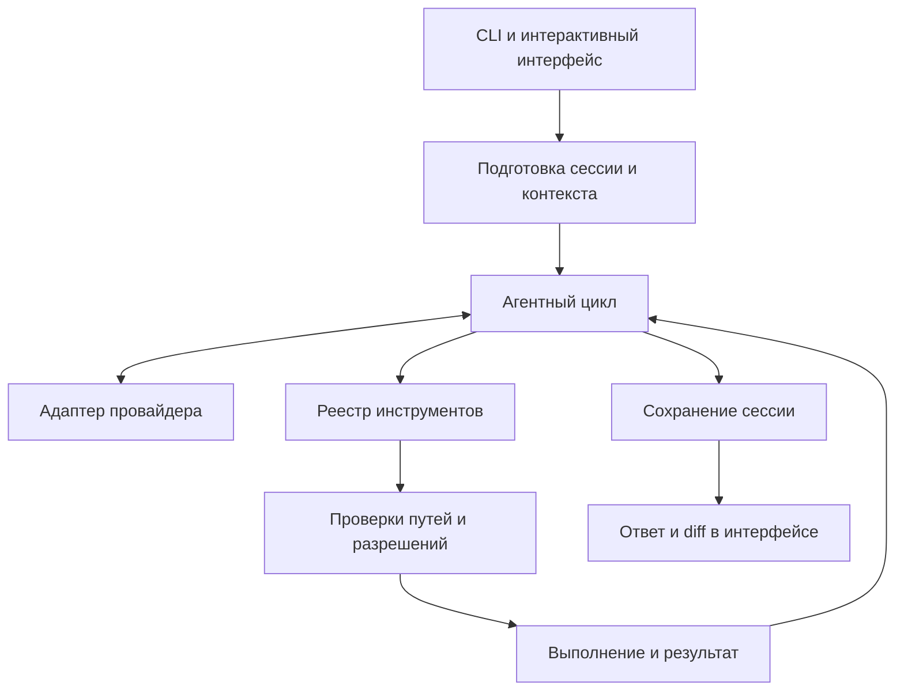

# Архитектура проекта

[Документация](README.md) · [Главная](../README.md)

## Путь запроса

`runPrompt` загружает настройки проекта, сессию, ключ и провайдера. Системная инструкция объединяет правила `CHISEL.md`, динамический контекст проекта и каталог навыков. Агентный цикл получает ответ модели, выполняет разрешённые вызовы инструментов и сохраняет контрольные точки сессии.

## Карта исходников

| Путь | Ответственность |
| --- | --- |
| [`src/cli.ts`](../src/cli.ts) | Аргументы CLI, служебные команды, запуск UI |
| [`src/commands/run.ts`](../src/commands/run.ts) | Подготовка запроса, выбор провайдера и ключа |
| [`src/core/`](../src/core) | Агентный цикл и системный промпт |
| [`src/providers/`](../src/providers) | Адаптеры API и нормализация URL |
| [`src/tools/registry.ts`](../src/tools/registry.ts) | Файловые, shell-, Git-инструменты и навыки |
| [`src/security/`](../src/security) | Разрешения и хранение ключей |
| [`src/utils/paths.ts`](../src/utils/paths.ts) | Проверка путей и исключений |
| [`src/config/`](../src/config) | Чтение конфигурации и правил проекта |
| [`src/sessions/`](../src/sessions) | Разговоры, индексы проектов и миграция |
| [`src/skills/`](../src/skills) | Обнаружение и загрузка навыков |
| [`src/ui/`](../src/ui) | React/Ink, настройки, транскрипт, diff и вывод одного запроса |
| [`src/types/domain.ts`](../src/types/domain.ts) | Общие типы провайдеров, инструментов и сессий |
| [`src/paths/home.ts`](../src/paths/home.ts) | Пути пользовательских данных |
| [`tests/`](../tests) | Unit- и integration-проверки |
| [`installer/`](../installer) | Windows-установщик и графические материалы |

## Контракты, которые важно сохранить

- `ProviderAdapter` отделяет агентный цикл от протокола API.
- `ApprovalGate` централизует решение о разрешении изменяющих инструментов.
- `FileDiff` передаётся отдельным полем; UI не восстанавливает его из окрашенного текста.
- Данные отображения diff сохраняются в сессии отдельно от сообщений провайдера.
- Разговоры связаны с проектом; пользовательские навыки живут в ChiselCode Home.

Подробности: [diff и UI](file-edit-ux.md), [безопасность](security.md), [сессии](sessions.md), [разработка](development.md).
