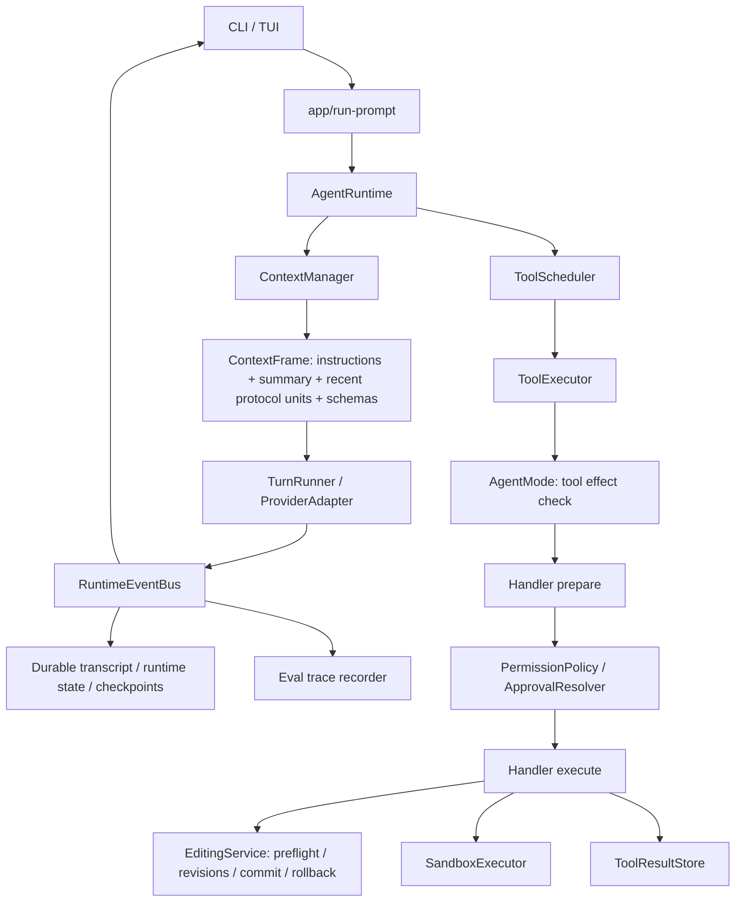
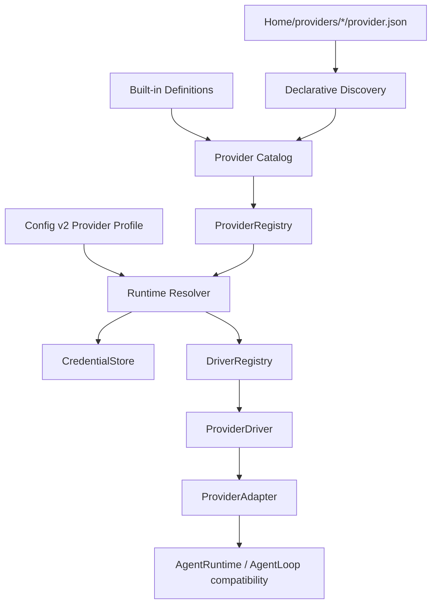

# Архитектура ChiselCode

[Документация](README.md) · [Главная](../README.md)

## Путь запроса

```mermaid
flowchart TD
  UI[CLI / TUI] --> Run[app/run-prompt]
  Run --> Runtime[AgentRuntime]
  Runtime --> Context[ContextManager]
  Context --> Frame[ContextFrame: instructions + summary + recent protocol units + schemas]
  Frame --> Turn[TurnRunner / ProviderAdapter]
  Turn --> Events[RuntimeEventBus]
  Events --> Session[Durable transcript / runtime state / checkpoints]
  Events --> UI
  Events --> Eval[Eval trace recorder]
  Runtime --> Scheduler[ToolScheduler]
  Scheduler --> Executor[ToolExecutor]
  Executor --> Mode[AgentMode: tool effect check]
  Mode --> Prepare[Handler prepare]
  Prepare --> Permission[PermissionPolicy / ApprovalResolver]
  Permission --> Execute[Handler execute]
  Execute --> Editing[EditingService: preflight / revisions / commit / rollback]
  Execute --> Sandbox[SandboxExecutor]
  Execute --> Artifact[ToolResultStore]
```

`src/app/run-prompt.ts` собирает зависимости, конфигурацию и сохранение. `AgentRuntime` управляет переходами turn, а `TurnRunner` нормализует provider stream. `src/core/agent-loop.ts`, `src/tools/registry.ts` и `src/commands/run.ts` оставлены как адаптеры старого API; business logic инструментов находится в handlers, executor и editing service.

## Plan / Build

`src/runtime/agent-mode.ts` определяет режимы, инструкции и политику допустимых effects. Plan показывает модели только инструменты `effect=read`. Executor повторно проверяет режим до parse/prepare/approval, в том числе для неизвестных модели вызовов и pending approvals. Build сохраняет существующую PermissionPolicy. Инструкции режима добавляются при сборке каждого контекста, включая emergency compaction.

`session.mode` хранит выбранный режим; `session.runtime.turnMode` фиксирует режим запроса. В TUI `agentMode` принадлежит контроллеру вкладки, `runningMode` показывает выполняющийся запрос. Очередь захватывает режим при отправке. Переключение UI не меняет runtime текущего запроса. Сохранение выбора после idle использует metadata update под тем же lock, что checkpoints; полный transcript не перезаписывается устаревшей копией. Подробнее о решениях и источниках: [режимы агента](agent-modes.md).

## Три вида состояния

| Сущность | Содержимое | Поведение при compaction |
| --- | --- | --- |
| `session.messages` | Полный durable transcript, включая calls/results | Не удаляется и не переписывается |
| `session.context.activeCheckpoint` | Structured summary, индекс границы, время и оценка tokens | Обновляется; модель получает summary и недавний хвост |
| `session.runtime` | Turn state, invocations, observed file revisions, loop guard | Сохраняется при checkpoint и resume |

Project sessions используют `schemaVersion: 3`, открытые providerId/profileId. Lazy migration v2 сохраняет transcript и дополняет runtime/context без записи при чтении. При загрузке граница checkpoint проверяется по длине истории, при сборке context — по атомарным protocol units.

## Контекст

ContextManager считает system, instructions, summary, сообщения и tool schemas, резервирует output и buffer. Для официального Anthropic используются capability/model metadata и count-tokens API; неизвестные context windows остаются `undefined`. Другие adapters используют локальную оценку UTF-8 bytes / 3. Это оценка размера, а не гарантия tokenizer провайдера. Явный `contextWindow` можно задать в `.chiselrc`.

Compaction работает на атомарных units: assistant с несколькими tool calls и все соответствующие tool results составляют один unit. Pending unit сохраняется. Новейший unit также сохраняется целиком; если он вместе с instructions/schemas уже превышает budget, runtime возвращает `CONTEXT_BUDGET_EXCEEDED`. Provider overflow разрешает одну emergency compaction и один retry на run.

Summary содержит goal, user constraints, architecture, decisions, completed work, changed files, verification, failed attempts, open problems, references и next action. P0 summarizer детерминированно извлекает наблюдаемые факты; он не использует дополнительную модель и сохраняет пользовательские сообщения целиком, чтобы не потерять constraints. Очень большие пользовательские инструкции могут поэтому потребовать сокращения самим пользователем. Точный выбор retained tokens и качество summary должны дальше оптимизироваться live evals.

Постоянного file tree в system нет. `InstructionResolver` читает корневые `CLAUDE.md`, `AGENTS.md`, `CHISEL.md`; native `CHISEL.md` имеет приоритет при конфликте. Инструкции являются контекстом, permissions исполняются отдельно. Directory-scoped resolution остаётся расширением следующего этапа.

Большие outputs сохраняются в закрытый session artifact store. В model-visible result остаётся короткий preview, `tool-result://UUID` и указание на `read_tool_result`. Reader принимает только artifact URI и диапазон строк; workspace boundary не расширяется. Полные diffs остаются отдельными UI-полями.

## Исполнение инструментов

`ToolCatalog` хранит definitions и selection API. `LocalToolProvider` и `SkillsToolProvider` поставляют handlers; новый provider не требует изменения AgentRuntime. Handler принимает schema-validated input, строит plan без mutation, затем выполняет его после policy/approval. Approval interaction находится исключительно в executor / approval resolver.

Invocation проходит `queued → prepared → awaiting_approval/running → succeeded/failed/denied/cancelled`. Pending approval не превращается в provider result и не удаляет assistant message. Уже выполненные calls сохраняются; resume исполняет только незавершённые. Deny становится коротким error tool result, после которого модель может продолжить.

Успешный duplicate call ID с тем же canonical input возвращает сохранённый результат. ID с другим input даёт `PROTOCOL_ERROR_DUPLICATE_CALL_ID`. Invocation, сохранённый как running до аварии, не переигрывается автоматически: возвращается `INTERRUPTED_INVOCATION`, поскольку исход mutation мог быть неизвестен.

Полностью read-only batch исполняется максимум четырьмя workers. Mixed batch идёт последовательно в provider order; результаты сохраняют исходный порядок при любом порядке завершения. AbortSignal проходит до handlers и shell. Cancelled calls получают явное состояние и result. Host executor завершает дерево процессов и сообщает `sandboxed=false`; permission policy не является OS sandbox.

После трёх одинаковых failures без runtime workspace change следующий вызов получает `REPEATED_CALL_DETECTED`. Это сигнал сменить стратегию, а не автоматическая остановка всего агента. Grep использует rg, а при его отсутствии — встроенный поиск; traversal исключает ignored/symlink paths и ограничивает объём.

## Editing

Read записывает canonical path → SHA-256 / size. Эти observations переживают resume. Write/edit/delete существующего файла требуют свежего read; изменение после read или approval обнаруживается повторной проверкой перед commit.

`apply_patch` поддерживает Add/Update/Delete, Move to, несколько hunks и файлов. Все paths, revisions, hunks и конечные contents проверяются до первой mutation. Commit готовит sibling temporary files, сохраняет mode и заменяет файлы через rename. При сбое уже применённые операции откатываются. Concurrent change, мешающий rollback, явно перечисляется в `PATCH_PARTIAL_FAILURE.details.rollbackFailed`. Полную filesystem transaction и защиту от всех OS-level TOCTOU races этот host implementation не обещает.

EditingService возвращает semantic model message, structured diffs, changes и новые revisions. Session сохраняет прежний undoStack; editing не зависит от его формата. Managed skill files используют тот же batch commit в отдельной, явно разрешённой области хранения. Для skill update plan также фиксируется до approval; project read-before-write не распространяется на этот явный managed-library update.

## Архитектурные инварианты

1. AgentRuntime не обращается к filesystem напрямую.
2. Tool handlers не показывают UI approvals.
3. Compaction не уничтожает durable transcript.
4. UI-specific diffs не отправляются provider.
5. Workspace-changing tool invocations проходят permission policy.
6. Структурированные файловые mutations проходят EditingService; shell и Git исполняются через собственные process contracts после policy.
7. Model-visible output может отличаться от raw artifact.
8. Permission policy не считается sandbox.
9. Provider wire quirks и SDK errors локализованы в drivers; TurnRunner принимает generic stream.
10. Изменения agent behavior должны сопровождаться conformance tests и измеримыми eval cases.

## Evaluation

`bun test` проверяет deterministic mechanics без платной модели. `evals/` создаёт изолированную копию fixture, выполняет setup, запускает настоящий AgentRuntime и оценивает команды, filesystem, forbidden diff paths и observable trajectory. JSON и Markdown reports сохраняют отдельные success/failure/infra_error, trace, tokens, tool/turn counts, compaction, artifacts и timings. Baseline comparisons требуют одинаковых task/trial/model/provider/fixture hash/settings.

Scripted provider измеряет механическую корректность, а не intelligence модели. Live suite запускается вручную или workflow_dispatch с точным model ID и credentials; runtime-only scripted cases помечены `mockOnly`. PR CI использует только conformance и deterministic evals. Текущий baseline старого runtime — `evals/baselines/runtime-v1-mock.json`. Comparative adapters Claude Code/OpenCode, model rubric grading и дорогие scheduled benchmarks не входят в P0.

## Границы расширений

MCP, LSP, subagents, hooks, worktrees, memory, background processes и полноценный OS sandbox не реализованы. Их границы: ToolProvider/ToolCatalog, RuntimeEventBus, ContextManager и SandboxExecutor. Это точки подключения, а не заявления о наличии этих функций.

## Главная и вкладки терминала

`TuiWorkspace` хранит отдельный `TuiController` для стартового экрана и каждой вкладки разговора. Стартовый экран не является вкладкой: `newDraft()` выбирает его, а `newTab()` вызывается после проверки первого запроса или при открытии сохранённой сессии. Контроллер владеет папкой, черновиком, лентой, потоковым ответом и прокруткой. История первого ввода и закреплённые навыки переходят в созданную вкладку, включая запрос в очереди; новый старт сбрасывает привязку навыков к предыдущему черновику по generation контроллера. Очередь связывает запрос с исходной вкладкой независимо от выбранного экрана. Закрытие вкладки не удаляет историю. Core Runtime v2 сохраняет этот UI и его regression tests.

## Provider architecture

Provider != Protocol != User Configuration.

**Provider Profile → Provider Definition → Protocol Driver → Provider Adapter → AgentLoop/AgentRuntime**. AgentLoop — прежний compatibility API над runtime v2, а не отдельная provider factory.

```mermaid
flowchart TD
  Builtins[Built-in Definitions] --> Catalog[Provider Catalog]
  Manifests[Home/providers/*/provider.json] --> Discovery[Declarative Discovery]
  Discovery --> Catalog
  Catalog --> Registry[ProviderRegistry]
  Profile[Config v2 Provider Profile] --> Resolver[Runtime Resolver]
  Registry --> Resolver
  Resolver --> Credentials[CredentialStore]
  Resolver --> Drivers[DriverRegistry]
  Drivers --> Driver[ProviderDriver]
  Driver --> Adapter[ProviderAdapter]
  Adapter --> Runtime[AgentRuntime / AgentLoop compatibility]
```

| Понятие | Ответственность |
| --- | --- |
| ProviderDefinition | Metadata сервиса без secret: ID, label, driverId, auth env names, endpoint policy/default, model, capabilities, driverOptions, optional exact-model pricing |
| Protocol Driver | Wire protocol, SDK, streaming/tools translation, usage/cache normalization и typed errors; driverOptions validation |
| ProviderProfile | Настройки одного аккаунта: providerId, apiKeyRef, label, baseUrl, defaultModel |
| ProviderAdapter | Runtime объект выбранного definition/profile/credential; providerId и обязательный streamChat, optional methods |
| ProviderRegistry | Definitions и source, duplicate/driver validation, lookup/list/search; не сканирует filesystem |
| DriverRegistry | Implementations по открытому driverId; один driver обслуживает много definitions |
| Provider Catalog | Built-ins + custom discovery, diagnostics и отключение всех duplicate custom IDs |

Resolver: profile lookup (selectProfile) → definition → transient/env/store credential → endpoint normalization → driver → adapter. App не импортирует SDK, env vars или конкретные constructors. Definition endpoint/default model — source of truth; global model другого provider не применяется.

Protocol drivers нормализуют TokenUsage.contextInputTokens: Anthropic input+cache, OpenAI prompt_tokens уже содержит cache. Core не проверяет provider ID. ProviderError расширен generic status/retryable categories; context_overflow/cancelled/transport/refusal сохранены для существующего Core Runtime v2. CostEstimate имеет optional USD, unknown pricing не free.

### Инварианты provider слоя

- AgentLoop/AgentRuntime знают только ProviderAdapter, ProviderRequest и StreamEvent; не Registry/Definition/Profile storage или SDK.
- UI/CLI получают каталог через ProviderRegistry; нет закрытой provider validation или отдельного label/default/env каталога.
- SDK imports и wire semantics находятся только в drivers.
- Persistent config/session identities — open strings, providerId/profileId; Session читается без установленного provider.
- Один driver обслуживает множество definitions; новое определение на существующем protocol не меняет generic layers.
- Profile владеет user config, CredentialStore — secrets, Definition — metadata.

### Manifest trust boundary

Discovery читает только immediate directories/provider.json, ограничивает size 256 KiB, отклоняет symlinks/junctions, namespaces/collisions/unknown drivers/invalid options/secret fields. Folder и manifest ID независимы, ID не filesystem path. Broken package не ломает built-ins. Discovery линейно читает packages; registry list упорядочен детерминированно. Нет credential lookup, SDK client creation, network или JS execution при startup.

Executable custom drivers не реализованы: file exists != trusted code. Будущая поддержка потребует digest/trust approval и typed worker IPC; child process сам по себе не sandbox. Сегодня protocol drivers только bundled source.

### Persistence и compatibility

Config v2 мигрирует v1 в памяти и делает config.v1.backup.json при первом реальном save. Session v3 мигрирует v2 только при чтении/сохранении отдельного файла; index v2 — rebuildable cache. Credentials не мигрируют. [Migration notes](provider-migration.md) описывают записи, backups и старый CLI.

Deprecated constructors в providers/openai.ts, anthropic.ts, agentrouter.ts и URL helpers остаются thin wrappers для старого API. ProviderKind/Schema — deprecated open-string aliases, не enum. Non-enumerable legacy config accessors и session.provider не сохраняются на диск. Runtime использует новые contracts; удаление wrappers не требуется для добавления providers.
