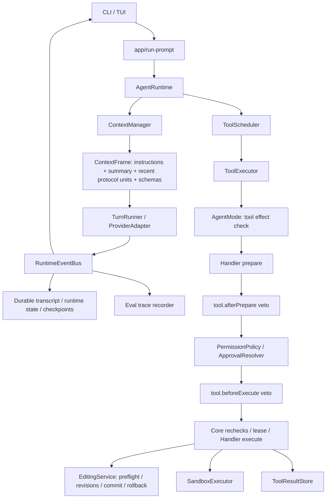
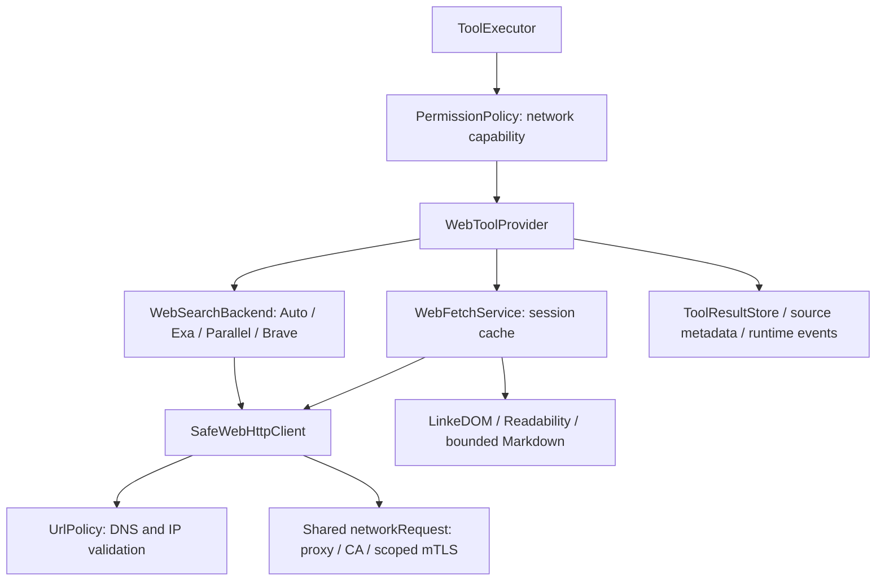
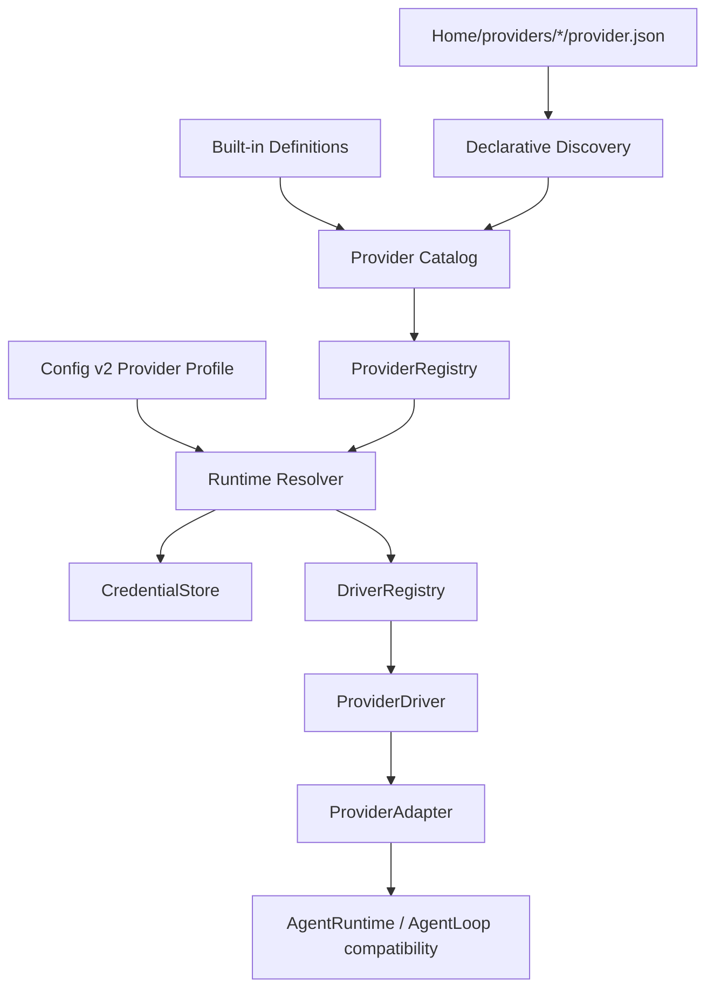

# Архитектура ChiselCode

[Документация](README.md) · [Главная](../README.md)

## Путь запроса


```mermaid
flowchart TD
  UI[CLI / TUI] --> Run[app/run-prompt]
  Run --> Runtime[AgentRuntime]
  Runtime --> Context[ContextManager]
  Context --> Frame[ContextFrame: instructions + summary + recent protocol units + schemas]
  Frame --> Turn[TurnRunner / ProviderAdapter]
  Turn --> Events[RuntimeEventBus]
  Events --> Session[Durable transcript / runtime state / checkpoints]
  Events --> UI
  Events --> Eval[Eval trace recorder]
  Runtime --> Scheduler[ToolScheduler]
  Scheduler --> Executor[ToolExecutor]
  Executor --> Mode[AgentMode: tool effect check]
  Mode --> Prepare[Handler prepare]
  Prepare --> AfterPrepare[tool.afterPrepare veto]
  AfterPrepare --> Permission[PermissionPolicy / ApprovalResolver]
  Permission --> BeforeExecute[tool.beforeExecute veto]
  BeforeExecute --> Execute[Core rechecks / lease / Handler execute]
  Execute --> Editing[EditingService: preflight / revisions / commit / rollback]
  Execute --> Sandbox[SandboxExecutor]
  Execute --> Artifact[ToolResultStore]
```

`src/app/run-prompt.ts` собирает зависимости, конфигурацию и сохранение. `AgentRuntime` управляет переходами turn, а `TurnRunner` нормализует provider stream. `src/core/agent-loop.ts`, `src/tools/registry.ts` и `src/commands/run.ts` оставлены как адаптеры старого API; business logic инструментов находится в handlers, executor и editing service.

`TuiWorkspace` владеет отдельным `TuiTabExecution` каждой вкладки: active run, очередь, AbortController и approval resolver. Follow-up сохраняет снимок модели, workflow и permissions и запускается после предыдущего запроса этой вкладки. Фоновые подтверждения переживают переключение экрана; Ctrl+C отменяет только выбранную вкладку. Первый сохранённый checkpoint закрепляет session ID за владельцем, чтобы открытие истории не создало второй запуск той же сессии.

В одном процессе `WorkspaceCoordinator` синхронизирует tools по каноническим путям workspace, общего Git root и ресурсов действия. Чтения разделяют доступ; изменение удерживает исключительный доступ до окончания execute и rollback. Ожидание approval происходит без блокировки. EditingService повторно проверяет ревизии файлов под блокировкой; process/git actions с устаревшим состоянием после подготовки возвращают `STALE_WORKSPACE`. Отмена ожидания освобождает очередь и не отменяет владельца workspace.

## Plan / Build

`src/runtime/agent-mode.ts` определяет режимы, инструкции и политику допустимых effects. Plan показывает модели только инструменты `effect=read` и `effect=external_read`. Executor повторно проверяет режим до parse/prepare/approval, в том числе для неизвестных модели вызовов и pending approvals. Build сохраняет существующую PermissionPolicy. Инструкции режима добавляются при сборке каждого контекста, включая emergency compaction.

`session.mode` хранит выбранный режим; `session.runtime.turnMode` фиксирует режим запроса. В TUI `agentMode` принадлежит контроллеру вкладки, `runningMode` показывает выполняющийся запрос. Очередь захватывает режим при отправке. Переключение UI не меняет runtime текущего запроса. Сохранение выбора после idle использует metadata update под тем же lock, что checkpoints; полный transcript не перезаписывается устаревшей копией. Подробнее о решениях и источниках: [режимы агента](agent-modes.md).

## Политика подтверждений

Порядок подтверждений задаётся отдельно через `ApprovalMode`: `default`, `acceptEdits`, `dontAsk`, `bypassPermissions`. `session.approvalMode` хранит выбор следующего запроса, `runtime.turnApprovalMode` — снимок текущего. TUI и очередь захватывают его вместе с workflow; `run-prompt` передаёт в runtime и executor. `setExecutionModes` сохраняет обе настройки атомарно без замены истории. Старые `ask/auto` преобразуются в `default/acceptEdits`. [Пользовательская инструкция](permissions.md).

`PermissionPolicy` решает `allow/ask/deny` после проверки ограничений Plan и подготовки действия. Accept edits автоматически разрешает effect `workspace_write`; `process`, `git_write`, `library_write` и внешние изменения проверяются отдельно. Dont ask отклоняет действия, требующие подтверждения. Все режимы сохраняют явные запреты, ограничения путей и проверки актуальности файлов.

Доступность Bypass хранится только в пользовательском config и проверяется runtime перед началом запроса, каждым действием и исполнением подготовленного действия. Её отключение возвращает выбравшие Bypass вкладки и очередь в Manual и отзывает доступ для следующих действий активного запроса. Записи Settings сериализуются с темой и sidebar; UI не исполняет инструменты; разрешения выдаёт PermissionPolicy через approval resolver. Для Web отдельное явное подтверждение может разрешить поиск или один домен на время текущей сессии.

## MCP через существующий runtime

`ToolSpec` хранит structured `source` (`local`, `skill`, `mcp`, `web`), effect и при необходимости `workspaceAccess`. MCP source сохраняет server ID, оригинальное имя, title, annotations и классификацию. `McpToolProvider` представляет ровно один сервер; `ToolCatalog.replaceProvider` атомарно публикует его snapshot. Вызовы выполняются тем же `ToolExecutor`, PermissionPolicy, scheduler, approvals, checkpoints и ArtifactStore, что локальные tools.

```mermaid
flowchart TD
  Catalog[ToolCatalog] --> Local[LocalToolProvider]
  Catalog --> Skill[SkillsToolProvider]
  Catalog --> MCP[McpToolProvider: один сервер]
  MCP --> Manager[McpConnectionManager]
  Manager --> SDK[McpConnection / официальный SDK]
  SDK --> Stdio[Stdio]
  SDK --> HTTP[Streamable HTTP]
  Manager --> Trust[ConfigStore / fingerprint trust]
  SDK --> Secrets[CredentialStorage / redactor / authentication]
  Manager --> UI[/mcp / CLI doctor]
```

Manager разделяет lifecycle соединения и cancellation каждого вызова. В TUI manager общий для вкладок одного проекта: отмена ожидания одной вкладки не обрывает инициализацию для остальных. Состояния explicit (`connecting`, `connected`, `authentication_required`, `reconnecting`, `error`, `disabled`, `disconnected`), budget reconnect ограничен и не повторяет tool calls. Потерянное изменение возвращает `executionUnknown`; новый catalog snapshot проверяется по fingerprint перед вызовом уже подготовленного handler. SDK получает точный discovery snapshot через `toolDefinition`, исключая скрытый повтор операции при ошибке согласования параметров. Повторяющиеся имена tools исключаются целиком, чтобы неоднозначная схема не меняла классификацию действия.

`McpRuntimeBinding` подключает providers и `discover_mcp_tools` к обычному каталогу. Turn selection ограничивает число MCP-схем до 32 и 96 KiB, учитывает prompt, pinned/explicit/recent tools; Plan filtering выполняется до выбора. Провайдеры модели получают детерминированные допустимые wire aliases; session/runtime сохраняют канонические `server.tool`, поэтому ограничения OpenAI/Anthropic на имена не разрушают namespaces.

Транспорт разрешает secret/env references, отделяет stderr от MCP stdout и нормализует SDK errors/results. Redactor применяется до events, результатов, artifacts и checkpoints. Progress — временное runtime event, не сообщения transcript. Capabilities resources/prompts/tasks сохраняются в connection info; `McpAuthentication` допускает официальный SDK OAuth provider. Автоматические sampling/elicitation не включены, неподдержанный `input_required` не становится фиктивным завершением. [Workflow, модель доверия и ограничения](mcp.md).

## Native Web

`WebToolProvider` регистрирует `web_search` и `web_fetch` через общий ToolCatalog. Их effect — `external_read`, permission — `network`, workspaceAccess — `none`. Поэтому Plan разрешает их, read scheduler запускает параллельно, а ожидание сети не удерживает workspace lock. AgentRuntime и UI не содержат HTTP-кода.

`ExaSearchBackend` и `ParallelSearchBackend` используют общий `HostedMcpSearchClient`: официальный SDK/Streamable HTTP согласует протокол и вызывает только фиксированный search tool через SafeWebHttpClient. SDK не может сменить endpoint, выполнить иной tool или получить автоматический sampling/elicitation. Адаптеры отдельно валидируют payload и нормализуют title/URL/domain/snippet; schema сервера и protocol envelopes не попадают в каталог модели. Parallel использует только `web_search`, страницы читает native fetch.

`AutoSearchBackend` — обычный WebSearchBackend с фиксированной цепочкой Exa → Parallel или Brave → Exa → Parallel при наличии ключа. В tool preview объявлены все кандидаты. PermissionPolicy выдаёт capability только для перечисленных и разрешённых hosts, повторно проверяя deny перед соединением. Роутер использует эти destinations, делит единый timeout между попытками и пробует каждый сервис не более одного раза при quota/outage/HTTP 401 или неверном результате/отсутствующей search capability. Для последнего RuntimeError содержит доверенную локальную phase; никакие повреждённые данные не становятся evidence. Deny, HTTP 403, SSRF, смена protocol endpoint, отмена и shared limits не вызывают failover. Result сохраняет реальный provider и routing.attempted; успешный пустой результат не меняет сервис. Явный provider не использует этот роутер.

`ToolSpec.guidance` содержит только доверенные инструкции native-инструмента. `ToolCatalog.instructionsForTurn` включает их для фактически выбранных tools и исключает MCP/skill content. Runtime получает инструкции через общий extension point RuntimeTools, до token budgeting/compaction; tool schemas и transcript не содержат guidance. Отключение Web убирает его инструкции при следующем выборе каталога. Общие правила недоверенных внешних данных действуют постоянно.

`src/network` отделяет пользовательские proxy/CA/mTLS от runtime и UI. `networkRequest` разделяет TLS и credentials proxy/origin; `enterpriseFetch` предоставляет SDK streaming HTTP с отменой и повторным выбором identity при redirect. Прямые SDK-запросы используют native Bun fetch с явным отключением proxy; отдельный Node transport разделяет TLS proxy/origin. Это сохраняет native lifecycle потоков там, где разделение proxy TLS не требуется. LLM drivers и HTTP MCP используют общий интерфейс, а SafeWebHttpClient дополнительно проверяет DNS и туннелирует CONNECT к публичному IP с byte/decompression/redirect limits. [Настройка сети](network.md).


```mermaid
flowchart TD
  Executor[ToolExecutor] --> Policy[PermissionPolicy: network capability]
  Policy --> Web[WebToolProvider]
  Web --> Search[WebSearchBackend: Auto / Exa / Parallel / Brave]
  Web --> Fetch[WebFetchService: session cache]
  Search --> HTTP[SafeWebHttpClient]
  Fetch --> HTTP
  HTTP --> URL[UrlPolicy: DNS and IP validation]
  HTTP --> Network[Shared networkRequest: proxy / CA / scoped mTLS]
  Fetch --> Extract[LinkeDOM / Readability / bounded Markdown]
  Web --> Results[ToolResultStore / source metadata / runtime events]
```

Network permission по умолчанию разрешает public search/fetch; явные Ask/Deny сохраняются, project config только ограничивает пользовательские права. Deny и отключение Web проверяются до Allow, tool/domain/session grants и Bypass. Capability выдаётся executor после успешной policy-проверки либо approval и проверяет каждое соединение, включая redirects и чтение из кеша. Allow не заменяет отдельную URL/DNS/SSRF boundary. Явный deny и отключение Web отзывают доступ даже после подтверждения. При Ask подтверждения параллельных calls сериализуются; после первой выдачи session grant ожидающий call повторно проверяет policy. Grants хранятся только в памяти процесса, scope включает workspace и session ID.

URL policy допускает публичные HTTP/HTTPS на портах 80/443 без credentials. Проверяются все DNS answers; transport соединяется с выбранным проверенным IP, а Host/SNI и TLS certificate validation используют исходный hostname. Это устраняет повторный DNS lookup между проверкой и соединением. Каждый redirect повторяет проверку; другое доменное имя требует действующего разрешения. HTTP client ограничивает response headers, connection/total timeout, redirects, compressed/decompressed bytes и cancellation. Shared limiter ограничивает concurrency и частоту, turn quota учитывает также cache calls.

Exa, Parallel и Brave находятся за интерфейсом WebSearchBackend и используют фиксированные endpoints. Exa и Parallel согласуют MCP без API-ключа; Brave не передаёт ключ при redirects или другим backends в Авто. CredentialStorage сохраняет ссылку; SecretRedactor убирает известный ключ до events, artifacts и checkpoints. Fetch не требует поискового ключа.

Extraction строит ограниченный DOM, удаляет UI noise и сохраняет headings, списки, таблицы и code blocks. LinkeDOM даёт небольшой DOM parser, Mozilla Readability помогает страницам без main/article; собственный Markdown serializer сохраняет технические примеры без browser runtime. Cache хранит только извлечённые документы, aliases canonical URLs, TTL и ограниченный LRU. Сессия сохраняет source metadata в invocation result details, без отдельного поискового индекса. Generic result references сохраняют происхождение «открыт»/«search hint»; compactor переносит наблюдавшиеся URLs и artifact URIs в importantReferences, включая модельное summary, с явной меткой недоверенных данных.

Tool results помечены `contentTrust: untrusted_external`. Закрытый artifact store сохраняет эту метку в sidecar; `read_tool_result` повторяет короткий reference framing для любого диапазона, включая повторный offload. Источники и предупреждение остаются данными tool protocol и не становятся system/developer instructions. Model instructions требуют проверять важные snippets через fetch и ссылаться на открытый final URL. Детерминированные fixture evals проверяют протокол и политику; устойчивость конкретной модели к prompt injection требует отдельного live eval.

## Три вида состояния

| Сущность | Содержимое | Поведение при compaction |
| --- | --- | --- |
| `session.messages` | Полный durable transcript, включая calls/results | Не удаляется и не переписывается |
| `session.context.activeCheckpoint` | Structured summary, индекс границы, время и оценка tokens | Обновляется; модель получает summary и недавний хвост |
| `session.runtime` | Turn state, invocations, observed file revisions, loop guard | Сохраняется при checkpoint и resume |

Project sessions используют `schemaVersion: 3`, открытые providerId/profileId. Lazy migration v2 сохраняет transcript и дополняет runtime/context без записи при чтении. При загрузке граница checkpoint проверяется по длине истории, при сборке context — по атомарным protocol units.

## Контекст

ContextManager считает system, instructions, summary, сообщения и tool schemas. Budget рассчитывается после подсчёта: output ограничен возможностями модели и свободным местом после buffer, без общего предела 4096 или четверти окна. Известный отдельный предел input также соблюдается. Ручные ограничения не увеличивают реальные пределы модели.

Drivers читают лимиты через настроенное подключение: OpenAI-compatible `/models`, Anthropic model metadata. Ошибка получения метаданных не блокирует запрос; резервные параметры точных ID находятся в `src/providers/model-limits.json` со ссылкой на [models.dev](https://models.dev/api.json) и датой обновления. Неизвестные ID не получают лимиты по похожему имени. Для OpenAI неизвестный output не отправляется; Anthropic требует явный предел, полученный из API, каталога или config.

`context_updated` передаёт снимок текущей проекции в session и UI до вызова модели и после ответа. Официальный Anthropic использует count-tokens API. При его недоступности и у остальных adapters применяется оценка UTF-8 bytes / 3; измеренный provider input калибрует последующие изменения истории. Кэш учитывается один раз по семантике протокола. Hidden reasoning/output usage не прибавляется как будто этот текст хранится в истории. После compaction новая проекция считается заново; при локальном подсчёте отношение наблюдаемого размера к локальной оценке переносится на новую проекцию. Cumulative session usage остаётся отдельно. UI отмечает оценку знаком `~` и не показывает процент при неизвестном окне.

Compaction работает на атомарных units: assistant с несколькими tool calls и все соответствующие tool results составляют один unit. Pending unit и новейший unit сохраняются целиком. Последний пользовательский запрос закрепляется дословно, даже если перед ним и после него было много вызовов инструментов. Если обязательный контекст уже превышает budget, runtime возвращает `CONTEXT_BUDGET_EXCEEDED`. При включённом autoCompact provider overflow допускает одну emergency compaction и один retry на run, только если размер запроса действительно уменьшился.

Summary содержит goal, user constraints, architecture, decisions, completed work, changed files, verification, failed attempts, open problems, references и next action. Production composition roots передают ContextManager модельный summarizer: тот же adapter/model получает предыдущее summary и старый префикс истории как данные, без tools. Логи и payloads ограничиваются preview со ссылками на artifacts; пользовательские инструкции не обрезаются. Ответ должен быть полным JSON по схеме. Verification берётся из наблюдавшихся tool results, changed files дополняются фактическим undoStack. При неизвестном окне, отказе, обрезанном или некорректном ответе используется детерминированное извлечение фактов с сохранением пользовательских сообщений целиком.

Compaction сначала строит кандидат checkpoint и считает полный запрос до/после. Только уменьшение контекста допускает замену activeCheckpoint; отмена не заменяет его. Durable transcript не изменяется. События started/completed/failed управляют временной карточкой, а успешные `context.compactions` сохраняют позицию, токены, точность, источник и время для replay. Эти UI-поля не попадают в ChatMessage. `context_summary_usage` учитывает вспомогательный запрос один раз отдельно от ответа агента.

Постоянного file tree в system нет. `InstructionResolver` читает корневые `CLAUDE.md`, `AGENTS.md`, `CHISEL.md`; native `CHISEL.md` имеет приоритет при конфликте. Инструкции являются контекстом, permissions исполняются отдельно. Directory-scoped resolution остаётся расширением следующего этапа.

Большие outputs сохраняются в закрытый session artifact store. В model-visible result остаётся короткий preview, `tool-result://UUID` и указание на `read_tool_result`. Reader принимает только artifact URI и диапазон строк; workspace boundary не расширяется. Полные diffs остаются отдельными UI-полями.

## Исполнение инструментов

`ToolCatalog` хранит definitions и selection API. `LocalToolProvider` и `SkillsToolProvider` поставляют handlers; новый provider не требует изменения AgentRuntime. Handler принимает schema-validated input, строит plan без mutation, затем выполняет его после policy/approval. Approval interaction находится исключительно в executor / approval resolver.

Invocation проходит `queued → prepared → awaiting_approval/running → succeeded/failed/denied/cancelled`. Pending approval не превращается в provider result и не удаляет assistant message. Уже выполненные calls сохраняются; resume исполняет только незавершённые. Deny становится коротким error tool result, после которого модель может продолжить.

Успешный duplicate call ID с тем же canonical input возвращает сохранённый результат. ID с другим input даёт `PROTOCOL_ERROR_DUPLICATE_CALL_ID`. Invocation, сохранённый как running до аварии, не переигрывается автоматически: возвращается `INTERRUPTED_INVOCATION`, поскольку исход mutation мог быть неизвестен.

Полностью read-only batch исполняется максимум четырьмя workers. Mixed batch идёт последовательно в provider order; результаты сохраняют исходный порядок при любом порядке завершения. AbortSignal проходит до handlers и shell. Cancelled calls получают явное состояние и result. Host executor завершает дерево процессов и сообщает `sandboxed=false`; permission policy не является OS sandbox.

После трёх одинаковых failures без runtime workspace change следующий вызов получает `REPEATED_CALL_DETECTED`. Это сигнал сменить стратегию, а не автоматическая остановка всего агента. Grep использует rg, а при его отсутствии — встроенный поиск; traversal исключает ignored/symlink paths и ограничивает объём.

## Editing

Read записывает canonical path → SHA-256 / size. Эти observations переживают resume. Write/edit/delete существующего файла требуют свежего read; изменение после read или approval обнаруживается повторной проверкой перед commit.

`apply_patch` поддерживает Add/Update/Delete, Move to, несколько hunks и файлов. Все paths, revisions, hunks и конечные contents проверяются до первой mutation. Commit готовит sibling temporary files, сохраняет mode и заменяет файлы через rename. При сбое уже применённые операции откатываются. Concurrent change, мешающий rollback, явно перечисляется в `PATCH_PARTIAL_FAILURE.details.rollbackFailed`. Полную filesystem transaction и защиту от всех OS-level TOCTOU races этот host implementation не обещает.

EditingService возвращает semantic model message, structured diffs, changes и новые revisions. Session сохраняет прежний undoStack; editing не зависит от его формата. Managed skill files используют тот же batch commit в отдельной, явно разрешённой области хранения. Для skill update plan также фиксируется до approval; project read-before-write не распространяется на этот явный managed-library update.

## Архитектурные инварианты

1. AgentRuntime не обращается к filesystem напрямую.
2. Tool handlers не показывают UI approvals.
3. Compaction не уничтожает durable transcript.
4. UI-specific diffs не отправляются provider.
5. Workspace-changing tool invocations проходят permission policy.
6. Структурированные файловые mutations проходят EditingService; shell и Git исполняются через собственные process contracts после policy.
7. Model-visible output может отличаться от raw artifact.
8. Permission policy не считается sandbox.
9. Provider wire quirks и SDK errors локализованы в drivers; TurnRunner принимает generic stream.
10. Изменения agent behavior должны сопровождаться conformance tests и измеримыми eval cases.

## Evaluation

`bun test` проверяет deterministic mechanics без платной модели. `evals/` создаёт изолированную копию fixture, выполняет setup, запускает настоящий AgentRuntime и оценивает команды, filesystem, forbidden diff paths и observable trajectory. JSON и Markdown reports сохраняют отдельные success/failure/infra_error/safety_violation, trace, tokens, tool/turn counts, compaction, artifacts и timings. Baseline comparisons требуют одинаковых task/trial/model/provider/fixture hash/settings.

Scripted provider измеряет механическую корректность, а не intelligence модели. Live suite запускается вручную или workflow_dispatch с точным model ID и credentials; runtime-only scripted cases помечены `mockOnly`. PR CI использует только conformance и deterministic evals. Текущий baseline старого runtime — `evals/baselines/runtime-v1-mock.json`. Comparative adapters Claude Code/OpenCode, model rubric grading и дорогие scheduled benchmarks не входят в P0.

## Границы расширений

P0 foundation, P1.1 tool contributions и P1.2 command contributions предоставляют небольшой **внутренний** API `src/extensions/index.ts` для доверенных definitions, переданных программно. `ExtensionHost` активирует их последовательно и один раз на canonical workspace root. TUI application владеет одним host, открывает scope выбранного проекта уже на welcome screen и переиспользует его между prompts/командами/вкладками. One-shot `runPrompt` владеет своим host и закрывает его в `finally`, включая ошибки до runtime; внутренний borrowed host/scope не закрывается после prompt. Отмена вкладки не отменяет shared activation и lifetime service. Shutdown сначала запрещает новые runs, отменяет и ожидает текущие, затем закрывает scopes и остальные ресурсы приложения, продолжая cleanup после отдельных ошибок.

Concurrent open одного root разделяет pending activation. Symlink/relative aliases используют один scope; вложенные workspace roots остаются самостоятельными, даже если WorkspaceCoordinator объединяет их для locks. Scope публикуется только после успешной activation всего списка. При ошибке удаляются частичные регистрации и закрываются учтённые ресурсы текущего расширения, затем предыдущих. Failed open допускает повторную попытку; поздний результат activation после shutdown не публикуется. Host может откатить только tracked registrations/resources, не произвольные filesystem/network effects extension. Cleanup идёт в обратном порядке, выполняется один раз и сохраняет attribution ошибок вместе с первичной причиной.

`createServiceToken<T>(diagnosticId)` связывает контракт на compile time; runtime identity — уникальный Symbol, не строка. Потребители используют тот же экспортированный token object. ServiceRegistry имеет required get, optional lookup и маленький child registry с parent lookup: duplicate/shadow запрещены, child не владеет parent services, закрытый parent делает lookup ошибкой. Регистрация не означает владение объектом: extension явно вызывает `ctx.add(disposable)` сразу после создания ресурса. Регистрации services/guards/context providers/tools/commands учитываются автоматически; все регистрационные методы закрыты после activation. Core получает конкретные ports, не общий DI container.

Два guards — только veto. `tool.afterPrepare` выполняется после release prepare read lease, перед policy/approval; `tool.beforeExecute` — после успешного permission/approval, перед running checkpoint, tool_started и execution lease. Порядок — activation order, затем registration order; первое deny/error/cancel останавливает pipeline. Непустой pipeline получает отдельный deep-frozen snapshot canonical input, source/effect, preview, command/diffs/resources/network metadata и идентичности операции. В нём нет handler, plan.data, Session, credentials или execution capabilities. Пустой pipeline не создаёт snapshot. `continue` не выдаёт permission; Plan, approval, live revocation, MCP fingerprint, network capabilities и stale checks сохраняются после callbacks/ожидания lease. Deny/error проходят обычный sanitization → artifact/result → terminal checkpoint → tool_failed, без ложного tool_started/workspace_changed. Коды: `EXTENSION_HOOK_DENIED`, `EXTENSION_HOOK_FAILED`; отмена использует `CANCELLED`.

Context providers возвращают только reference text. Identity — `(extensionId, providerId)`, порядок collection такой же, один immutable snapshot на вызов. Перед каждой фактической попыткой основного model request, включая recovery/overflow retry, собираются свежие contributions. Renderer экранирует source metadata отдельно от content, добавляет attribution/reference framing и применяет существующий redactor. Core правило не даёт данным instruction/permission authority; XML framing само по себе не защищает от prompt injection.

ContextManager добавляет один обычный **user** message перед `assembleMessages(session)`. Это request-only projection, не новый durable пользовательский запрос и не system/native guidance. Одна projection используется exact countTokens, local requestTokens, frame.messages, streamChat, projected compaction, refresh и emergency compaction. Refresh не вызывает providers повторно; следующий request не накапливает старые contributions. Summarizer получает только durable history/current request, без исходного extension context. Session schema, transcript и summary не расширяются. При невозможности уложиться в budget возвращается `CONTEXT_BUDGET_EXCEEDED` с source attribution, без silent truncation пользовательских условий. Внутренние лимиты: **32 KiB UTF-8 на contribution и 128 KiB на collection вместе с framing**, до/после redaction; превышение/неожиданная ошибка дают `EXTENSION_CONTEXT_FAILED` до model request. `undefined` и пустой текст пропускаются.

Callbacks guards/context проверяют signal до/после вызова и используют abortable waiting с удалением listener и обработкой позднего reject. Это отменяет ожидание, не произвольный JavaScript. Workspace services общие и сами отвечают за concurrency методов; snapshots/session/operation signals отдельных runs не разделяют mutable state. RuntimeEventBus остаётся awaited observer/recorder: listeners не возвращают решений и не меняют approved input. Guards не создают события на каждый callback или token delta.

Пример linked extension (подключается программно в composition, без поиска файлов):

```ts
import { z } from "zod";
import { createServiceToken, defineTool, type ChiselExtension } from "./extensions/index.js";

export const counter = createServiceToken<{ count: number }>("example/counter");
export const example: ChiselExtension = {
  id: "example",
  activate(ctx) {
    const service = { count: 0, dispose() { this.count = 0; } };
    ctx.add(service);
    ctx.services.provide(counter, service);
    const shared = ctx.services.get(counter);
    ctx.contextProviders.register({
      id: "state",
      collect: () => ({ text: `Workspace count: ${shared.count}` }),
    });
    ctx.tools.register(defineTool(
      { name: "state", description: "Read the workspace counter", effect: "read",
        permission: "read", parallelSafe: true, workspaceAccess: "none" },
      z.object({}).strict(),
      async () => ({ data: undefined, preview: "Read workspace counter", resources: [] }),
      async (invocation) => {
        invocation.signal?.throwIfAborted();
        return { output: `Workspace count: ${shared.count}` };
      },
    ));
    ctx.commands.register({
      name: "example-state",
      description: "Show the workspace counter",
      usage: "/example-state",
      parse(args) {
        if (args) throw new Error("This command takes no arguments.");
      },
      execute(invocation) {
        return invocation.tools.execute("ext:example:state", {});
      },
    });
    ctx.guards.afterPrepare(({ tool }) => tool.effect === "external_destructive"
      ? { action: "deny", reason: "External destructive actions disabled." }
      : { action: "continue" });
  },
};
```

**Tool contributions P1.1:** `ctx.tools.register` доступен только внутри activation и не возвращает unregister/execution capabilities. `defineTool` согласует Zod schema, parse и prepared data с обычным ToolHandler. Core проверяет local name, description, object JSON schema (draft-07/2020-12), effect, permission metadata, parallelSafe, workspaceAccess и конечные положительные timeout/output limits. Read effects не могут просить workspace write access. Caller не передаёт source/guidance/MCP permission hooks; MCP approval metadata из prepare отклоняется до policy. Metadata/schema копируются и deep-freeze, callable references фиксируются с их `this`; shared service state не копируется.

Local `state` из примера становится **`ext:example:state`**; ID владельца сохраняется буквально, включая `/`, `.`, uppercase и `_`. Canonical имя используется в session, fingerprint и approvals; ProviderToolNames даёт wire alias `ext_…_<hash>` длиной до 64 ASCII символов и возвращает canonical имя до executor. Source — `{ type: "extension", extensionId: "example", originalName: "state" }`. Core присваивает `details.extension = { id, tool }` результатам/ошибкам, не доверяя owner из handler result. Attribution сохраняется additive в session v3, виден в approvals и live/replay `[extension] example · state`; старые sessions остаются читаемыми. Handlers/services не сериализуются, persisted source не восстанавливает отсутствующий executable tool.

Workspace contributions остаются staged до завершения всей activation. Host отслеживает их registration cleanup, sealing, rollback и lifetime вместе с остальными ресурсами. `attachExtensionTools(scope, catalog)` атомарно привязывает полный sealed provider snapshot к **одному prompt catalog**. `replaceProvider` проверяет внутренние дубли, requested/handler names и чужие registrations до синхронной публикации; ошибка не меняет старый snapshot/selection. Conflicts отклоняются независимо от порядка attachment, включая последующие MCP refresh. Binding снимается в finally даже при setup failure; его dispose не закрывает borrowed workspace/services и bindings других prompts. Одновременный attachment в один catalog не заменяет чужой binding.

Execution остаётся `ToolScheduler → ToolExecutor`: mode check, parse, prepare под read lease, afterPrepare, policy/approval без lock, beforeExecute, running checkpoint, execution lease/core rechecks, execute, sanitize/normalize/artifacts. `prepare` не выполняет mutations; callbacks получают текущий invocation context и используют EditingService, sandbox и выданную networkAuthorization для соответствующих действий. `permission` — metadata, не enforced capability: PermissionPolicy принимает решение по effect и command/network/settings. Plan разрешает read/external_read; Bypass/acceptEdits не отменяют Plan или guards. Пустые diffs/resources extension write не доказывают no-op и не обходят policy; native editing no-op сохранён. Trusted guidance явно исключает extensions.

Lifetime workspace объединяется с caller signal на всём execution path, включая approval и явный scheduler signal. Adapter не начинает prepare/execute после закрытия scope. Timeout/cancel cooperative: mutation lease освобождается только после завершения callback, revision отмечается и при partial error/cancellation. Отмена одного prompt не закрывает shared workspace. Нормальный владелец сначала отменяет/ожидает runs, затем закрывает host/services. Outputs/rawOutput/previews/errors используют существующие redactors и ToolResultStore; большой результат читается через обычный read_tool_result.

**Встроенный consumer:** production CLI/TUI явно используют `defaultExtensions()` с `builtin.project`. `ext:builtin.project:manifest` читает только корневые `package.json`, `pyproject.toml`, `Cargo.toml`, `go.mod`, без recursive discovery, scripts, process/network и instruction authority. Schema — `z.object({}).strict()`: неизвестные path/command fields отклоняются. Данные читаются заново в execute, лимит **512000 bytes на файл**, paths/symlinks/ignore revalidated через WorkspacePolicy; ignored и missing пропускаются, IO/oversize/outside-root errors возвращаются честно. Чтение обновляет EditingService observations. Существует ограниченная in-process TOCTOU защита по общим path rules, не OS filesystem sandbox.

Универсальный `new ExtensionHost([])` остаётся пустым. Явный borrowed host/scope уважает собственные definitions; TUI не добавляет built-ins повторно в runPrompt. Явный `{ extensions: [...] }` задаёт точный linked список; `defaultExtensions([example])` явно объединяет consumer с custom definitions. Duplicate IDs не игнорируются. Loader, settings/installation/trust UI, hot reload и публичный SDK пока отсутствуют.

**Command contributions P1.2:** `ctx.commands.register` регистрирует slash head во время activation и автоматически отслеживается теми же frames, sealing и reverse rollback. Имя без `/` соответствует `^[a-z][a-z0-9-]{0,63}$`; description — непустой plain text до **240 символов**, optional usage — до **160 символов**, без terminal controls и переводов строки. Core копирует metadata, фиксирует callable references с исходным `this` и формирует identity `{ type: "extension", extensionId, name }`. После activation/dispose registration закрыта; сохранённый adapter не исполняет закрытый scope. Slash `/example-state` не является model tool или wire alias; вызванный tool сохраняет `ext:example:state` и собственный source.

Одна projection объединяет полные core descriptors (включая `/sidebar`, `/resume`, `/new`, `/clear`), свежий список user-invocable skills и sealed extension commands. Она используется resolution, autocomplete и typo hints. Built-in collision отклоняется при registration, extension duplicates — с rollback activation. Skill collision атомарно отклоняет весь extension command layer, оставляя built-ins/skills доступными и shared services/tools живыми. Skills перечитываются после activation и перед queued dispatch; захваченный owner не перенаправляется на новый skill/extension. Позднее открытие другого root не заменяет projection текущего экрана. Parser case-sensitive, отделяет head по whitespace, trim только края args, не интерпретирует quotes/backslashes как shell. Unknown slash не отправляется модели.

Renderer исполняет только core UI commands; extension callback запускается один раз application dispatch после parse. Autocomplete вставляет текст, но не вызывает callback. Commands и prompts используют одну `TuiTabExecution` очередь: root, controller generation, mode, approval mode и owner захватываются при submit. Первая command operation на главной создаёт обычную conversation/session без model adapter, API key или chat request; меню и `/cwd` без аргументов её не создают и не ждут незавершённую activation. Extension dispatch ждёт актуальный scope. Очередь не переносит операции после смены generation/root; поздняя home operation не меняет выбранную в это время вкладку. Ctrl+C отменяет active operation, очередь и ожидание scope текущей вкладки; соседние вкладки, shared activation и workspace services продолжают работу.

Invocation содержит только readonly workspace/session/invocation IDs, mode, approvalMode, combined signal и `tools.execute(canonicalName, input)`. Нужные services замыкаются при activation. Session allocation использует существующие provider/model metadata и обычный createSession; локальная команда работает до настройки profiles, не создаёт профиль в config и не запрашивает credentials. Совместимые Session default IDs сохраняются; модель для следующего agent prompt настраивается обычным способом. `src/app/tool-runtime.ts` собирает один и тот же Local/Skill/Web/MCP/extension catalog, ApprovalGate, scheduler/executor, redactors, checkpoints и artifacts для prompt и command paths; listing commands не запускает MCP processes. Command tool calls проходят Plan, explicit deny, guards, approval, stale/revocation/network checks. Effect определяет policy; permission metadata и command owner не выдают прав. Port закрывается после callback; незавершённые core tools обязательно awaited до освобождения conversation/binding. Cancellation callbacks cooperative, без принудительной остановки JS или раннего release mutation lease.

Command feedback санитизируется и нормализуется существующим ToolResultStore; уже нормализованный tool artifact не копируется. Denied/cancelled/pending tool result сохраняет status/errorCode, callback не превращает его в success. Core присваивает `details.command = { name, extensionId }`; настоящие tool events сохраняют tool attribution, pure feedback не генерирует fake tool events. UI feedback не записывается автоматически в user/system/model history и не обещает восстановление после restart. Tool invocation records, observations, diffs и artifacts сохраняются в обычной session v3; завершённые callbacks/mutations не replay. Одинокие tool_result messages без tool_use не создаются. P1.2 не добавляет конкретных production-команд, Commander runner или меняет one-shot slash semantics.

**Модель доверия:** расширения работают в процессе и имеют права процесса. Readonly API, tokens и snapshots помогают избежать ошибок, но не изолируют код: extension может напрямую импортировать filesystem/process/network, читать environment или блокировать event loop. Credentials автоматически в ExtensionContext не выдаются; service token не является security capability. Гарантии permissions/guards относятся к core execution path, не к произвольным side effects JS.

**Storage/следующий loader:** существующие `chiselHomeDir()` platform/XDG rules, `globalConfigPath()` и project `.chiselrc` сохранены. P0 не создаёт extension directory/config/manifest и не загружает user JS. Будущий installation root естественно расположен под `join(chiselHomeDir(), "extensions")`; точный layout определяется loader. Loader должен валидировать metadata/API/integrity и получить trust конкретной версии/content **до import()**, поскольку top-level код исполняется при import. Проверка exported definition после import этого не заменяет. Project requirements не дают trust и не скачивают/исполняют код автоматически; install scripts/dependencies также входят в trust. npm/GitHub/marketplace adapters позже передают definitions тому же host, не создают второй runtime. Native modules требуют отдельной проверки Bun/OS совместимости. Manifest permissions без изоляции не защищают от прямых вызовов процесса; будущий sandbox требует RPC/ограниченного SDK, произвольные service objects не переносятся через него автоматически.

LSP уже использует workspace service, tools, commands и context provider через эти ports. Worktrees используют отдельные workspace scopes и core repository service. Memory, subagents и jobs пока отсутствуют: memory/jobs смогут использовать workspace services, memory — context provider; subagent получит отдельный runtime с явными зависимостями, worktree — отдельный workspace scope. Tool и command contributions доступны; UI slots появятся отдельным портом. Существующие local tools, MCP, Web и provider drivers не мигрированы в extensions.

## Главная и вкладки терминала

`TuiWorkspace` хранит отдельный `TuiController` для стартового экрана и каждой вкладки разговора. Стартовый экран не является вкладкой: `newDraft()` выбирает его, а `newTab()` вызывается после проверки первого запроса или при открытии сохранённой сессии. Контроллер владеет папкой, черновиком, лентой, потоковым ответом и прокруткой. История первого ввода и закреплённые навыки переходят в созданную вкладку, включая запрос в очереди; новый старт сбрасывает привязку навыков к предыдущему черновику по generation контроллера. Очередь связывает запрос с исходной вкладкой независимо от выбранного экрана. Закрытие вкладки не удаляет историю. Core Runtime v2 сохраняет этот UI и его regression tests.

## Provider architecture

Provider != Protocol != User Configuration.

**Provider Profile → Provider Definition → Protocol Driver → Provider Adapter → AgentLoop/AgentRuntime**. AgentLoop — прежний compatibility API над runtime v2, а не отдельная provider factory.


```mermaid
flowchart TD
  Builtins[Built-in Definitions] --> Catalog[Provider Catalog]
  Manifests[Home/providers/*/provider.json] --> Discovery[Declarative Discovery]
  Discovery --> Catalog
  Catalog --> Registry[ProviderRegistry]
  Profile[Config v2 Provider Profile] --> Resolver[Runtime Resolver]
  Registry --> Resolver
  Resolver --> Credentials[CredentialStore]
  Resolver --> Drivers[DriverRegistry]
  Drivers --> Driver[ProviderDriver]
  Driver --> Adapter[ProviderAdapter]
  Adapter --> Runtime[AgentRuntime / AgentLoop compatibility]
```

| Понятие | Ответственность |
| --- | --- |
| ProviderDefinition | Metadata сервиса без secret: ID, label, driverId, auth env names, endpoint policy/default, model, capabilities, driverOptions, optional exact-model pricing |
| Protocol Driver | Wire protocol, SDK, streaming/tools translation, usage/cache normalization и typed errors; driverOptions validation |
| ProviderProfile | Настройки одного аккаунта: providerId, apiKeyRef, label, baseUrl, defaultModel |
| ProviderAdapter | Runtime объект выбранного definition/profile/credential; providerId и обязательный streamChat, optional methods |
| ProviderRegistry | Definitions и source, duplicate/driver validation, lookup/list/search; не сканирует filesystem |
| DriverRegistry | Implementations по открытому driverId; один driver обслуживает много definitions |
| Provider Catalog | Built-ins + custom discovery, diagnostics и отключение всех duplicate custom IDs |

Resolver: profile lookup (selectProfile) → definition → transient/env/store credential → endpoint normalization → driver → adapter. App не импортирует SDK, env vars или конкретные constructors. Definition endpoint/default model — source of truth; global model другого provider не применяется.

Protocol drivers нормализуют TokenUsage.contextInputTokens: Anthropic input+cache, OpenAI prompt_tokens уже содержит cache. Core не проверяет provider ID. ProviderError расширен generic status/retryable categories; context_overflow/cancelled/transport/refusal сохранены для существующего Core Runtime v2. CostEstimate имеет optional USD, unknown pricing не free.

### Инварианты provider слоя

- AgentLoop/AgentRuntime знают только ProviderAdapter, ProviderRequest и StreamEvent; не Registry/Definition/Profile storage или SDK.
- UI/CLI получают каталог через ProviderRegistry; нет закрытой provider validation или отдельного label/default/env каталога.
- SDK imports и wire semantics находятся только в drivers.
- Persistent config/session identities — open strings, providerId/profileId; Session читается без установленного provider.
- Один driver обслуживает множество definitions; новое определение на существующем protocol не меняет generic layers.
- Profile владеет user config, CredentialStore — secrets, Definition — metadata.

### Manifest trust boundary

Discovery читает только immediate directories/provider.json, ограничивает size 256 KiB, отклоняет symlinks/junctions, namespaces/collisions/unknown drivers/invalid options/secret fields. Folder и manifest ID независимы, ID не filesystem path. Broken package не ломает built-ins. Discovery линейно читает packages; registry list упорядочен детерминированно. Нет credential lookup, SDK client creation, network или JS execution при startup.

Executable custom drivers не реализованы: file exists != trusted code. Будущая поддержка потребует digest/trust approval и typed worker IPC; child process сам по себе не sandbox. Сегодня protocol drivers только bundled source.

### Persistence и compatibility

Config v2 мигрирует v1 в памяти и делает config.v1.backup.json при первом реальном save. Session v3 мигрирует v2 только при чтении/сохранении отдельного файла; index v2 — rebuildable cache. Credentials не мигрируют. [Migration notes](provider-migration.md) описывают записи, backups и старый CLI.

Deprecated constructors в providers/openai.ts, anthropic.ts, agentrouter.ts и URL helpers остаются thin wrappers для старого API. ProviderKind/Schema — deprecated open-string aliases, не enum. Non-enumerable legacy config accessors и session.provider не сохраняются на диск. Runtime использует новые contracts; удаление wrappers не требуется для добавления providers.

## Workspace LSP и Settings (P1.3)

`defaultExtensions(custom, { configPath })` явно включает `builtin.project`, configured `builtin.lsp` и `builtin.btw`. Точный borrowed host/scope и `ExtensionHost([])` не получают built-ins скрыто. Activation LSP создаёт `LspService`, сначала учитывает `ctx.add(service)`, затем предоставляет typed token и регистрирует tools, commands/context. Activation не spawn-ит process и не читает model credentials. Runtime/executor не знают конкретный backend; app composition связывает Settings с узким status/apply/restart port.

Service принадлежит canonical workspace, переиспользует server entries/generations между prompts и вкладками. Документы и transport shared; Session, ToolContext, observations, signal и approval resolver передаются на отдельный вызов, не сохраняются в service. Start/initialize имеют один pending promise. Abort одного caller снимает только ожидание/его language request; restart явно отменяет старую generation и восстанавливает tracked documents. Host shutdown происходит после cancel/await runs и закрывает transport, таймеры и descendants (POSIX process group; Windows Job Object с kill-on-close, включая crash parent).

Default режим — Auto. `src/lsp/catalog.ts` — linked декларативный каталог языков, project markers, pinned versions, installation recipes и backend-specific безопасных defaults. Generic client не содержит веток для каждого языка: выбирает descriptor по файлу, canonical project root и capabilities, а manual `backend: generic` задаёт language IDs, extensions, argv и bounded initialization/settings. Mutable state принадлежит отдельным server entries workspace service (server ID + project root); service не хранит Session/ToolContext между вызовами. Одна entry имеет один pending start; caller abort отменяет ожидание, workspace shutdown — подготовку и процесс.

Встроенные TLS 6.0.1 + TS 6.0.3 остаются offline payload под Bun. Остальные Auto recipes извлекают закреплённые официальные artifacts/npm dependency lock в private versioned cache. Node/Go/Rust/.NET/Java/Dart runtimes готовятся по потребности; Swift и Ruby требуют установленного SDK. `provision.ts` фиксирует preview/fingerprint до download: executable path не считывается из изменяемого cache marker и не меняется после approval. Archive extraction ограничивает bytes/files, запрещает traversal/links/devices; npm install scripts не запускаются. Go fixed-module build и offline gem install выполняются вне workspace с bounded logs, cancellation и process-tree cleanup. Загрузки используют существующий public/DNS/redirect guard и конечный core-owned список delivery hosts; агент не получает эту capability.

Auto не требует per-project trust; manual executables/entrypoints должны находиться вне workspace и требуют exact canonical trusted root. Global off нельзя отменить project override. Save/revocation/config change fence results старой generation; смена launch требует restart. Shared caches не являются sandbox: стандартный language server выполняется с правами пользователя и может анализировать/исполнять проектную конфигурацию и dependencies. Client DTO/path filtering не изолирует внутренний filesystem/network/process доступ сервера.

Шесть tools `ext:builtin.lsp:{status,diagnostics,definition,references,symbols,restart}` регистрируются обычным `ctx.tools.register`. Первые пять имеют read effect; restart имеет process/write access и normal command preview, Plan/permissions/guards/stale rechecks. Prepare не запускает server и не посылает requests. Status и commands listing не spawn-ят process. `/lsp-status` и `/lsp-restart [serverId]` используют P1.2 tools port, общую conversation queue и реальные invocation checkpoints без model chat. Service не выполняет arbitrary LSP methods, returned commands или `workspace/applyEdit`.

Transport использует `vscode-jsonrpc` для Content-Length byte framing/correlation/cancellation; дополнительный bounded frame guard ограничивает header/body до JSON decoder. Поддерживаются fragmented/coalesced UTF-8, server requests с allowlisted configuration, MethodNotFound и applyEdit:false. EOF/protocol error/crash закрывают generation и pending requests без auto-restart. Cancellation также освобождает pending library waiter; поздний response игнорируется. Environment минимален, stderr хранится только в ограниченном redacted ring, raw protocol/cause не сериализуются.

Explicit file tools читают проверенные saved bytes через WorkspacePolicy, ограничивают UTF-8/binary/size, revalidate canonical paths и записывают actual EditingService observation. Locations без чтения target bytes observation не дают. URI — стандартный file URL, координаты — zero-based UTF-16; unsafe/external/ignored locations отфильтровываются с omitted count. Full/Incremental sync используют монотонную version и полный replacement range прежнего текста. LRU sends didClose; generation/hash/workspace revision/policy fences не позволяют выдать изменившийся результат как текущий. Coordinator revision обнаруживает и частичные/отменённые mutations; bounded hash refresh обнаруживает внешний editor без recursive watcher.

Diagnostics имеют pending/current/observed/stale/unavailable. Matching versioned push даёт current; если сервер объявляет LSP 3.17 diagnosticProvider, client использует document pull report, привязанный к синхронизированной revision/generation с последующей проверкой bytes. Push subsets такого сервера не заменяют полный pull snapshot. Rust получает curated initialization options до discovery; Cargo manifest reload разрешён, build scripts/proc macros/compiler checks выключены. TypeScript server 6.0.1 push unversioned, поэтому его payload всегда observed; provisional empty и timestamp не подтверждают revision/отсутствие ошибок. После invalidation старые error claims исключены. Context provider не spawn-ит server и не синхронизирует изменённые документы по сети: за bounded read lease проверяет tracked bytes, включает только current и availability для observed. Snapshot идёт через P0 request-only projection/redactor/token accounting, без system authority или durable memory.

Budgets: initialize 15 s; request 10 s; diagnostics wait 3 s; shutdown 2 s + tree termination; collect 250 ms. Frame 8 MiB/header 8 KiB, stderr 64 KiB, pending 32/server, ingress burst 256. Document 512000 bytes, 64 tracked/16 MiB cache, diagnostics 100/file, navigation/symbols 200, provider 8 KiB/20 diagnostics. Нет silent source truncation: oversized/binary/invalid UTF-8 дают controlled failure; result truncation отмечается и использует общий artifact pipeline.

Settings descriptor catalog задаёт stable routes, groups, descriptions и metadata-only field search. Shell управляет route/search/focus, independent navigation/content scrolling, wide/compact layout и contextual actions; native Connection/Appearance/Permissions, Web/LSP panels и controlled MCP/Skills adapters сохраняют drafts. UI не получает mutable extension scope/process/DI container. Captured app actions соблюдают configPath, origin root/controller/generation; queued restart исполняется тем же command/tool path, а закрытие формы не dispose shared service. Config save patch/revision и atomic storage сохраняют unrelated sections и не запускают process.

LSP panel показывает Auto / Своя настройка / Выключено, project inheritance/override и advanced custom path/argv/trust controls. Core prompt рекомендует доступную LSP навигацию и diagnostics после правок, сохраняя read-before-write и tests. Это доверенное правило core, а не extension guidance или поднятие diagnostics в system authority.

Это internal trusted in-process subsystem: readonly API и policy path не изолируют произвольный JS или language server. P1.3 не добавляет внешний loader/SDK, настройку Extensions, sandbox, LSP mutations или full-project diagnostics coverage. `/help` остаётся удалённой пользовательской командой; LSP команды видны через обычный autocomplete/projection.

### Запросы модели и побочные вопросы

`builtin.btw` входит в явный `defaultExtensions([], { configPath })`. `/btw <вопрос>` — command contribution с immutable `executionPolicy: "side_query"`; default policy остаётся `foreground`. Lane определяется metadata contribution, а не именем в renderer. `ExtensionHost([])` остаётся пустым, /help не возвращён.

Invocation-bound `model.request({ text, context: "conversation" | "none", limits? }, observer?)` выдаёт один текстовый completion выбранной модели. Core присваивает owner/operation/session/root/generation, фиксирует profile/model/endpoint и history синхронно при submit. Side invocation имеет model port и immutable identities, без `tools`. Foreground invocation сохраняет tools port и дополнительно получает lazy model port: local commands по-прежнему не требуют ключа или provider bootstrap. Сохранённый port после закрытия invocation отклоняет новые calls до сети; начатые, даже не awaited callback, calls tracked и awaited core.

`src/app/model-runtime.ts` используется prompt и command paths для existing profile/catalog/credential/driver/enterprise transport resolution. Секреты остаются core-only. `ModelRequestService` не создаёт AgentRuntime, MCP binding, scheduler или workspace lease для сети; tools пустые. Tool-use/refusal/пустой или незавершённый protocol response получает terminal failure с сохранением partial. Project constraints берёт обычный core bootstrap; reference projection истории не читает новые исходники и не обновляет LSP/MCP. Budget включает core rules, project constraints и исходный вопрос; они не обрезаются ради истории.

`ConversationSourceBridge` получает узкий snapshot accessor настоящего живого Session owner. До первого checkpoint он сохраняет принятый user prompt и ждёт единственную session allocation. Projection содержит summary, завершённые messages/tool groups и пометку выполняющейся операции; partial streaming, orphan tool results, будущие queued prompts и прошлые side answers исключены. Capture больше не меняется от foreground completion. Side context не вызывает live ContextManager/compaction/model summarizer и не меняет stable main-history fingerprint.

Core owns concurrency (1/conversation, 4/application), дедлайн 120 s от submit, question 8 KiB, snapshot 64 KiB, input 16 000 estimated tokens, output 2048 tokens / 64 KiB. Known model limits дополнительно уменьшают cap; неизвестное окно не выдумывается. Меньшие limits разрешены, большие clamp. Transport SDK retries/compatibility retries для этого purpose выключены: core допускает максимум три HTTP completion attempts только после explicit 429/5xx до text delta. После text/неизвестного исхода/terminal success повторов нет. Setup/counting/backoff/persistence входят в дедлайн; небольшая часть того же дедлайна резервируется terminal checkpoint.

Side events не попадают в main RuntimeEventBus/recorder. Streaming sanitizer использует bounded holdback, включая известные credentials, split-delta secrets и terminal controls. Accounting берёт только observed provider usage, отдельно отмечает unknown/partial, считает цену по captured definition/model. Side spend включён в conversation total, но не в occupied main context, request duration или tool counters. Запоздалый usage обновляет только исходный operation ledger idempotently, без позднего UI text.

Session schemaVersion остаётся 3: optional typed `sideQueries`, `sideQuerySpend`, `mainSpend`. `ProjectSessionStore.save` под existing index lock читает последние side metadata/accounting; `patchSideQuery` под той же lock меняет только один operation record и derived accounting. Это merge последних полей, а не mutex над двумя устаревшими whole snapshots. Main messages/runtime/preferences/diffs и side answers сохраняются при любом порядке checkpoint. Сохраняются последние 50 terminal текстовых records плюс active; компактные per-operation spend entries сохраняют aggregate и idempotence после удаления старого текста. Полная копия capture не сохраняется: только provenance/ranges/estimates. Resume owner boundary помечает незавершённые записи interrupted без model replay/auto-open.

TUI foreground queue и side operations принадлежат conversation, но имеют разные abort/owner resources. Side finally не трогает activeRun, approval resolver или очередь. Shutdown fences/aborts/awaits оба пути до host cleanup. Отдельное floating view — core presentation, не extension UI slots. Trusted in-process JS не sandbox; cancellation provider/callback cooperative, API не обещает принудительное завершение произвольного JS.

## Сервис рабочих копий

`builtin.worktrees` подключён в явную default composition; пустой `ExtensionHost([])` остаётся пустым. Factory владеет application/repository bookkeeping; workspace service token даёт captured-root port. Registry identity — canonical `git-common-dir`; workspace — working root + worktree-specific git-dir, полученные через Git и realpath, включая linked `.git` file и вызов из subdirectory.

`src/worktrees` готовит immutable private snapshots и планы. Mutation capability находится в core WeakMap, привязана к Session/invocation/lifetime; JSON input и mutable plan.data её не подделывают. Только ToolExecutor после Plan/policy/approvals/guards выдаёт одноразовый grant. Core-issued mixed access plan захватывается один раз: source read, origin write, worktree-local index/HEAD, repository-common Git metadata и registry. Повторного acquire внутри handler нет. File roots независимы; shared refs/config/registrations и generic shell используют common Git write lease. Revisions затрагивают write resources, не все файловые observations соседних worktrees.

Global/per-repository registry использует version checks, atomic fsync/rename и existing cross-process Home lock. Create intent хранит immutable base до mutation; apply intent — source/target identity, selected before/after hashes и Session/invocation checkpoint link. Reconciliation не replay-ит разрешение. Ownership marker и disk stamp защищают от случайной подмены registry/path; это не sandbox против JS с полным доступом пользователя. Use admission/remove делят registry lock; heartbeats проверяют host/PID и Linux process start identity, неизвестный живой owner блокирует remove.

Default worktree registration идёт перед LSP: reverse scope cleanup сначала останавливает процессы, потом освобождает use lease. Origin и все открытые tabs удерживают свои scopes; последний ушедший root закрывает LSP/scope, сохраняя disk tree. `run-command` выдаёт foreground invocation только narrow `worktrees.open(ID)`; verified descriptor передаётся core application action, удерживая admission lease до открытия scope/tab. Side-query context `/btw` этого port не получает. Session.worktree — optional presentation metadata schema 3, не capability.

Apply использует existing EditingService.replaceBatch/commit, реальные fresh-read observations, staged writes, validation перед каждым write и concurrent-safe rollback. Другого patch engine/executor/history store нет. Git driver использует executable+argv, minimal environment без Git routing variables, bounded binary output, deadlines/tree termination; hooks, fsmonitor, external diff/textconv и auto-maintenance отключены. Доступ к Home не расширяет WorkspacePolicy: только issued capability конкретного owned tree/origin. Подробные пределы и recovery: [Worktrees](worktrees.md).

## Формат сессий и совместимость

Сессия сохраняет режим работы `mode` и порядок подтверждений `approvalMode`; runtime хранит отдельные снимки выполняющегося запроса. Вкладки и очередь сохраняют собственные значения. Метаданные меняются под общей блокировкой без перезаписи истории. Для старой сессии без approvalMode значение по умолчанию определяется конфигурацией проекта. Подробнее: [разрешения](permissions.md).

Сессия проекта сохраняет schemaVersion=3, providerId (произвольная строка), profileId и model. Сохраняются полная переписка, runtime/context, summary/checkpoint, undo и структурированные diff интерфейса. Формат v2 с provider мигрирует в памяти в providerId и `${provider}-default`; slash пространства имён заменяется дефисом в старом ID профиля. При чтении файл не переписывается. Следующие checkpoint/save/rename атомарно сохраняют v3. Отдельная резервная копия сессии автоматически не создаётся; резервная копия конфигурации описана в [переносе настроек](provider-migration.md).

Неизвестный или удалённый провайдер не мешает чтению истории и summary. Новый запрос получает контролируемую ошибку недоступности; нужен явный выбор доступного профиля. Отсутствующий профиль также требует выбора. Индекс сессий schemaVersion=2 — восстанавливаемый кэш: старый или повреждённый индекс строится из файлов без их перезаписи. Прежний реестр проектов schemaVersion=1 не меняется. Для старых вызовов сохраняется неперсистентный совместимый alias provider; сохранённая идентичность не зависит от enum.

## Помощники

Отдельные AgentRuntime выполняют ограниченные задачи владельца: чтение в origin или реализацию в detached рабочей копии. Core управляет scheduler, captured context, ceiling, approvals и расходами; правое дерево показывает задачи по typed descriptors. Подробности вынесены в [сервис помощников](architecture/subagents.md), действия пользователя — в [руководство](subagents.md).
