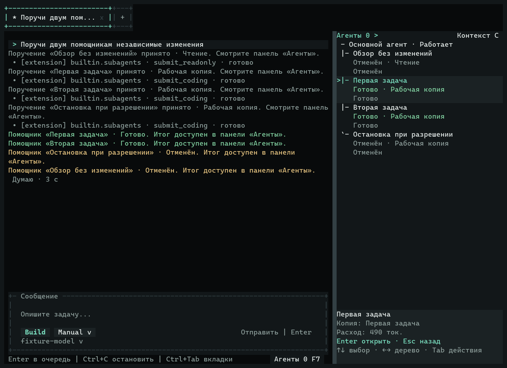
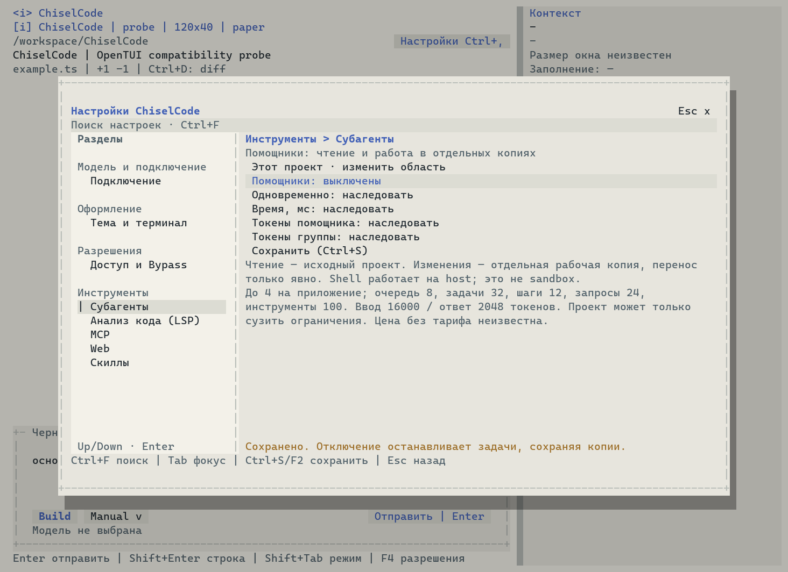

# Проверка помощников и правой панели

[Материалы участников](../README.md) · [Пользовательская справка](../../subagents.md) · [Внутренний контракт](../../architecture/subagents.md)

## Статус и база

Реализация P2.2 подготовлена прямо в `main`, без новых веток, worktrees для разработки и PR. Проверенная исходная база — `687fe370729f71f813e1a7144ca78ddd755d2078`, версия 0.6.20. Новая версия — **0.6.21**. Коммит, итоговый CI и опубликованный выпуск будут указаны после завершения проверок; локальные результаты не заменяют подтверждение остальных платформ.

## Что изменилось

`builtin.subagents` входит в ordinary default composition. Родительские production tools и `/agent` принимают задачи; core запускает собственный AgentRuntime, Session, ContextManager, tool runtime и checkpoint writer помощника. Это полноценный цикл model → tools → model, а не побочный текстовый completion `/btw`.

Для coding создаются owned detached worktrees существующим P2.1 executor/approval path. Readonly имеет enforced allowlist и пересечение frozen parent ceiling с актуальными global/origin/child policy. Подделка source, alias и прямой вызов write/shell не расширяют readonly. Дети не делегируют дальше, не управляют Git refs/worktrees и не применяют свои результаты.

Правое представление «Агенты» использует существующую панель; «Контекст» сохранён. Выбор по child ID, порядок по durable ordinal. Viewer показывает настоящую child history, diff и result, не создавая conversation или request. F7 открывает дерево; S останавливает выбранную задачу, включая адресованный approval. Ctrl+C проверяет input owner до отмены основной работы. Settings снова центрированный popup до 104×30, с левым каталогом и разделителем внутри него.

Ключевые изменения находятся в `src/subagents`, `src/app/subagent-runtime.ts`, `src/security/approval-arbiter.ts`, `src/extensions/builtins/subagents.ts`, существующих executor/access/session seams и native TUI components. Private одноразовая Worktree capability разрешает только конкретный core create/read plan. Общая Git-блокировка остаётся; параллельный create перепроверяется WorktreeService, а не отвергается по unrelated common revision.

## Настоящий сценарий

`tests/fixtures/subagents-runtime.ts` отправляет production parent запрос контролируемому OpenAI-compatible HTTP endpoint. Родитель делегирует две coding задачи. Каждый помощник читает `same.txt`, меняет его через core EditingService и завершает новый model turn. Настоящие Git/files/store/executor не заменяются mocks. Origin и unrelated dirty файл сохраняются; refs/heads не пополняются. После обычного diff/apply первый результат переносится, второй получает conflict до записи; повтор первого — no-op. Index и HEAD origin сохраняются.

`tests/fixtures/tui-subagents.ts` запускает обычный `runOpenTuiAgent` с реальным OpenTUI renderer. Основной model request удерживается HTTP barrier. Два coding помощника завершаются после отдельных адресованных edit approvals, readonly помощник читает файл и выдаёт partial stream. Ещё один coding помощник остановлен непосредственно на своём edit approval: подготовленная запись не выполняется. Локальная S в просмотре readonly отменяет только его; основной запрос и siblings продолжают работу. Пользователь открывает историю/diff/result, меняет размер терминала, закрывает и снова открывает сохранённый разговор. История загружается даже при открытии viewer до окончания owner binding; новых model requests и replay нет.

## Ограничения и восстановление

Только один уровень делегирования; default 2 active на owner / 4 на приложение, queue 8, accepted 32. Deadline 10 минут включает очередь/approvals. 12 iterations, 24 observable attempts, 100 tools; 16 000 estimated input / 2048 output. Reservations child/group атомарны. SDK retries и compatibility fallback отключены для child; единственный bounded transient retry до text включён в budget. Unknown outcome сохраняет резерв и unknown cost.

Task records schema 1 живут в canonical Home; Session/global schema версии остаются 3/2 с optional typed metadata. Parent main/side/child patches merge-ятся под существующим index lock; cumulative child receipts заменяются по revision, не прибавляются повторно. Child technical Sessions исключены из обычного списка разговоров, чтобы inclusive parent expense не считался дважды. Активные records не вытесняются; 33-я задача получает явный отказ. Файлы/копии/retained commits не удаляются по таймеру.

После crash saved active records становятся interrupted только после process identity проверки; неизвестный live owner блокирует новый runtime. Pending tools не запускаются через ordinary resume child. Cleanup ограничен десятью секундами; неподтверждённый writer сохраняет recovery block на apply/remove. Ни worktree, ни trusted in-process JS не являются OS sandbox. Shell одного repository сериализуется общим Git lease. MCP и произвольные extension tools детям не выдаются; зависимостям не выполняется auto-install.

## Проверки

Локальное окружение: Linux x64, Bun **1.4.2**, Node **24.19.0**, OpenTUI **0.5.12**, Git **2.52.0**. Реальные LSP regressions используют внешний typescript-language-server **6.0.1** и TypeScript **6.0.3**, а не dev TypeScript приложения. Отдельно проверяется минимальный Git **2.39.5**.

Локально завершены `bun run typecheck`, `bun test` (**1091 pass, 1 skip, 0 fail; 9657 assertions, 124 файла**), `bun run lint` (exit 0, 47 warnings и 14 infos), `bun run eval --category all` (**14/14** deterministic cases успешны), `bun run build` и `bun run compile`. Единственный skip — существующая проверка native OS clipboard, требующая desktop; untouched baseline имел такой же skip. Untouched baseline: 1069 pass, 1 skip, 0 fail. После правки hook routing targeted native UI regression завершился: **75 pass, 0 fail, 677 assertions**. Captured model race проверяет модель на submit и смену выбора до старта queued child.

`subagents-cli.ts ./dist/chisel` прошёл настоящий loop и сохранение, Plan refusal, unavailable headless approval и запрет unrestricted child resume. `subagents-runtime.ts` отдельно прошёл с Git **2.39.5**. Полный `command-packaging.ts` прошёл установленный bundle и compiled native TUI для commands, LSP Settings/real server, параллельного `/btw`, рабочих копий и помощников. Обычный `chiselcode-0.6.21.tgz` установлен отдельно: production entrypoint прошёл тот же CLI loop. Архив **около 5,64 МБ / 18 файлов**, без test fixtures и smoke bundles.

Проверены относительные ссылки/anchors/images: **37 Markdown документов, 306 локальных ссылок, 6 изображений, 18 anchors**, без ошибок. Неиспользованные desktop/macOS/Windows окружения локально не заявляются проверенными; матрица CI выполняет native tests, установленный package и compiled paths на всех трёх ОС.

Для воспроизведения:

```bash
bun scripts/prepare-lsp-tests.ts
bun run typecheck
bun test
bun run lint
bun run eval --category all
bun run build
bun run compile
bun tests/fixtures/command-packaging.ts
bun tests/fixtures/subagents-cli.ts bun dist/cli.js
bun tests/fixtures/subagents-cli.ts ./dist/chisel
CHISEL_CAPTURE_DIR=/absolute/captures bun tests/fixtures/tui-subagents.ts
```

Внешние модели и платные API для проверки не требуются. Budget tests используют настоящие OpenAI и Anthropic drivers/HTTP attempts: 429×2 → success даёт три обращения; missing terminal и partial error не повторяются. Redaction проверяется через границы text deltas. Fault runner используется только для lifecycle races, не вместо acceptance tool loops.

## Кадры настоящего OpenTUI

PNG ниже растеризованы из `captureSpans` с фактическими цветами и геометрией; рядом сохранены `captureCharFrame` TXT и raw JSON. Это native renderer, не browser/imagegen mockup. Визуально проверены широкая/маленькая панели, темы Obsidian, Paper, Graphite, Ember, ASCII/Unicode, selected/focused row, queued/approval/failed/interrupted и partial states.

- [Настоящая делегация и дерево, 120×40](../../assets/subagents/ordinary-tui-120x40-tree.png): [TXT](../../assets/subagents/ordinary-tui-120x40-tree.txt), [JSON](../../assets/subagents/ordinary-tui-120x40-tree.json).
- [История](../../assets/subagents/ordinary-tui-120x40-details.png), [diff](../../assets/subagents/ordinary-tui-120x40-diff.png), [итог](../../assets/subagents/ordinary-tui-120x40-result.png), [история после открытия сохранённого разговора](../../assets/subagents/ordinary-tui-120x40-resumed-history.png).
- [Отдельное разрешение первого](../../assets/subagents/ordinary-tui-120x40-approval-1.png) и [второго](../../assets/subagents/ordinary-tui-120x40-approval-2.png) помощника; [реальная остановка отдельной задачи](../../assets/subagents/ordinary-tui-120x40-approval-stop.png), [остановка в approval при 24×8](../../assets/subagents/obsidian-24x8-child-approval-stop.png).
- [Partial до остановки](../../assets/subagents/ordinary-tui-120x40-readonly-partial.png) и [после неё](../../assets/subagents/ordinary-tui-120x40-cancelled-partial.png).
- Resize: [160×50](../../assets/subagents/ordinary-tui-160x50-result.png), [80×24](../../assets/subagents/ordinary-tui-80x24-result.png), [40×12](../../assets/subagents/ordinary-tui-40x12-result.png), [24×8](../../assets/subagents/ordinary-tui-24x8-result.png).
- Темы: [Obsidian](../../assets/subagents/obsidian-true-160x50-tree.png), [Paper](../../assets/subagents/paper-true-160x50-tree.png), [Graphite](../../assets/subagents/graphite-true-160x50-tree.png), [Ember/recovery](../../assets/subagents/ember-true-120x40-recovery-tree.png).
- [32 записи в Paper/ASCII, 24×8](../../assets/subagents/paper-ascii-24x8-32-records.png): клавиатурой достигнута последняя задача; footer и back доступны.
- [Настройки помощников, Paper](../../assets/subagents/paper-settings-subagents-120x40.png); восстановленный общий popup: [Obsidian 120×40](../../assets/subagents/settings-popup-obsidian-120x40.png), [Paper 40×12](../../assets/subagents/settings-popup-paper-40x12.png).





Тесты используют реальные input/mouse события и сохраняют main draft/scroll. Native screenshot редких error states — fixture данных, что явно отличается от приведённого выше production scenario. Источник общих surface/Palette/scroll/ownership patterns — существующие ChiselCode Dialog/sidebar и API установленного OpenTUI 0.5.12; не добавлены отдельная дизайн-система или TreeRenderable.

[Материалы участников](../README.md) · [Разработка](../../development.md) · [Рабочие копии](../../worktrees.md)
