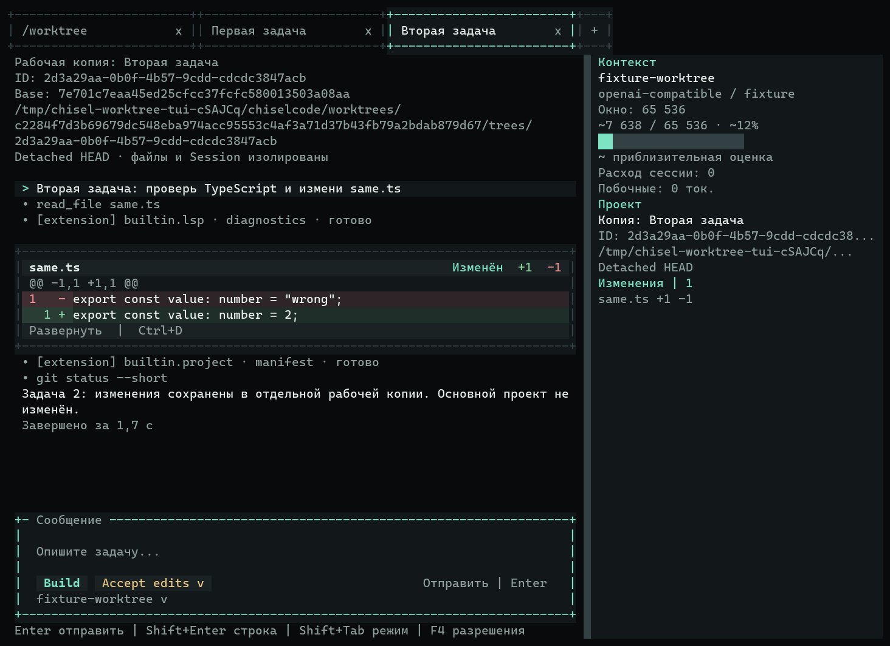
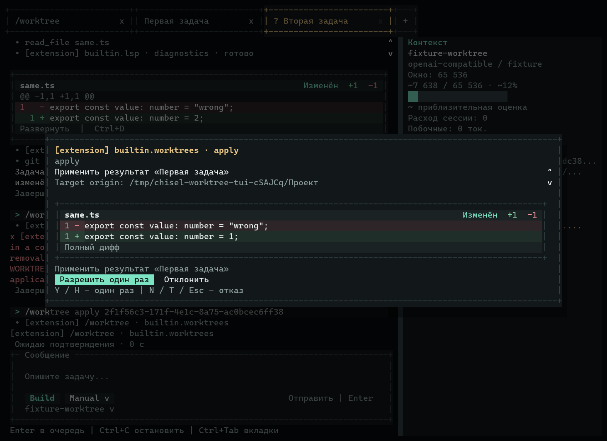

# Рабочие копии: отчёт о реализации

[Материалы для участников](../README.md) · [Пользовательская справка](../../worktrees.md) · [Внутренний API](../../architecture.md#сервис-рабочих-копий)

Этап P2.1. Реализация — коммиты `624f5f2` и `20caef2` в main. [CI проверенного runtime](https://github.com/TheAsrada/ChiselCode/actions/runs/37916097895) успешно завершён на Windows/macOS/Linux, включая настоящий LSP, установленный пакет и compiled CLI/TUI. [Выпуск 0.6.20](https://github.com/TheAsrada/ChiselCode/releases/tag/v0.6.20) опубликован с этого коммита; [Release workflow](https://github.com/TheAsrada/ChiselCode/actions/runs/37918000618) успешно собрал и опубликовал четыре установщика. Номер этапа не заменяет сведения о доступности функции в релизе.

База: main `c5c94ec7b5311b2c75e08925990a4b684e69fe7a`, v0.6.19. Реализация и коммиты выполнены прямо в main; ветки, worktrees для разработки и PR не создавались. Управляемые detached worktrees в Home и временных Git-репозиториях — сама функция этого этапа. Версия результата — 0.6.20, по отдельному поручению владельца.

## Изменение поведения

Ранее параллельные вкладки использовали обычные папки без управляемой изоляции. Теперь встроенное расширение `builtin.worktrees` предоставляет шесть инструментов и `/worktree`: create/list/status/diff/open/apply/remove. Команда выполняется в основной очереди; локальным операциям не нужны запрос к модели или API-ключ. Open проверяет descriptor, удерживает блокировку допуска и создаёт настоящий разговор TUI по новому root. В обычном CLI показывает тот же проверенный путь для штатного запуска агента.

WorktreeService использует canonical Git common-dir, отдельные workspace git-dir/root, реестр Home версии 1, неизменяемый маркер владения, записи намерений и межпроцессные сигналы использования. Core planner поддерживает смешанные ресурсы чтения/записи без повторного захвата. Файловые операции разных копий параллельны, общие изменения Git и shell одного репозитория последовательны. Writer реестра проверяет token и revision перед изменением и атомарной заменой: возобновлённый прежний writer не перезаписывает нового владельца. Чтение списка не отменяет ожидающее подтверждение; отказ помечает неисполненное создание без появления папки.

Результат включает коммиты, подготовленные к коммиту, незакоммиченные и допустимые новые файлы относительно неизменяемого base. Apply сохраняет байты выбранного UTF-8 результата через существующий пакетный EditingService/commit, действительные наблюдения чтения, обычные подтверждения, guards, checkpoints и artifacts. Перед записью повторяются проверки source, target Git identity и policy. Конфликт, устаревший план или неподдерживаемый выбор блокируют весь набор. Обычная ошибка использует штатный откат с защитой чужих байтов; аварийное завершение требует сверки хешей без повторного выполнения.

Remove не имеет force/discard, блокируется пользователями, изменёнными, подготовленными, новыми, игнорируемыми или конфликтующими файлами, блокировками и незавершённым состоянием. Результат чистой копии с новым коммитом удерживается во внутренней ссылке до удаления и переживает перезапуск/GC. Ошибка удержания сохраняет папку. Закрытие вкладки или prompt не удаляет файлы; scope/LSP завершаются до освобождения блокировки использования. Поддерживаются `.git` как папка и файл, локальные ресурсы Git и canonical root. Session версии 3 получила необязательные данные worktree только для отображения; ключи и история в реестр не копируются.

## Реальные проверки

Linux: Bun 1.4.2, Node 24.19.0, Git 2.52.0 и отдельно собранный официальный Git 2.39.5. Настоящий сервер TypeScript: typescript-language-server 6.0.1 / TypeScript 6.0.3 с внешним Node; TypeScript из зависимостей приложения не используется вместо сервера.

Git-интеграция использует настоящие репозитории и файлы, production host/catalog/executor/policy/store, две detached копии и обычные локальные инструменты. Проверены CRLF, Unicode и переносы строк в именах, сохранность веток/HEAD/индекса, переносы committed/staged/unstaged/new/delete, отсутствие записи одинакового результата, конфликт задач, изменения source/target во время подтверждения, Plan/deny/Dont Ask, откат и ошибка отката при чужой записи, hooks/filters, неизвестные владельцы, подмена реестра и symlink, удержанные ссылки после GC, настоящие инструменты общих refs и отмена. SIGKILL-тесты проверяют создание/удаление/перенос в контрольных точках; срок брошенной тестовой блокировки продвигается только после завершения дочернего процесса. Отдельное чередование показывает, что возобновлённый старый writer не стирает новую сверку состояния.

TUI запускает обычное приложение с default composition через настоящий OpenTUI. Пользователь создаёт две копии с подтверждением, открывает отдельные вкладки; агент через настоящий драйвер выполняет read, LSP diagnostics, write, manifest и Git. Проверены разные Session IDs, наблюдения и байты, исходный проект без изменений, перенос из другой вкладки, конфликт и отказ, закрытие изменённой вкладки, Settings, /btw и завершение дочерних процессов. Модель и сеть изолированы управляемым endpoint; Worktree/Git/LSP executor не подменяется.

`command-packaging.ts` сохраняет сценарии команд, LSP Settings и побочных вопросов, добавляя проверку рабочих копий установленного пакета и compiled CLI/TUI. CI выполняет полный набор на Windows/macOS/Linux. Release workflow проверяет Windows, macOS arm64/x64 и Linux, публикует четыре установщика. Тестовые загрузчики и скрытые флаги в приложении отсутствуют.

Финальный локальный прогон:

| Команда | Результат |
| --- | --- |
| `bun run typecheck` | успешно |
| `bun test` | 1069 успешных, 1 пропуск, 0 ошибок; 9342 проверки, 119 файлов |
| `bun run lint` | 421 файл, без ошибок |
| `bun run eval --category all` | все 14 воспроизводимых сценариев успешны |
| `bun run build` / `bun run compile` | успешно, версия 0.6.20 |
| `bun tests/fixtures/command-packaging.ts` | все 8 сценариев установленного пакета и compiled CLI/TUI успешны |
| `bun tests/fixtures/worktree-cli.ts ./dist/chisel` | обычный compiled CLI: полный сценарий успешен |
| Git 2.39.5: `bun test tests/integration/worktrees-runtime.test.ts` | 12 успешных, 0 ошибок; 114 проверок |

Единственный пропуск — существующий тест буфера обмена ОС в среде без графического сеанса; Worktree/LSP/Settings/`/btw` не пропущены. Успешные Actions подтверждают платформы отдельно от локального прогона Linux.

Дополнительно скачан опубликованный `ChiselCode-Setup-0.6.20-linux-amd64.deb`: размер 36818284 байта и SHA-256 совпали с метаданными GitHub:

```text
398d61246f913e8eded37d8ba8a04972bd2309ae233aedf68eddb63b76c6cdf4
```

Извлечённый `usr/bin/chisel` показывает 0.6.20 и прошёл `worktree-cli.ts`: detached create, независимые правки агента/manifest/Git, preview/apply/conflict, безопасное удаление и сохранение результата в коммите. Это проверка опубликованного бинарника, а не только сборки из исходников.

## Реальные кадры интерфейса

Кадры получены captureCharFrame/captureSpans OpenTUI 0.5.12. PNG растеризует те же терминальные ячейки и RGBA; исходные TXT/JSON лежат рядом. Проверены 120×40, 100×30, 80×24, 60×20, 40×12 и 24×8; Obsidian/Paper, ASCII/Unicode. Геометрия и native editing подтверждают доступность окна/ввода, сохранение черновика при resize и клавиатурное подтверждение на маленьком экране. Кадры вручную просмотрены; длинные подписи ограничены и прокручиваются, действия не перекрывают активное поле.





[Светлая тема](../../assets/worktrees/apply-paper.png) · [Конфликт](../../assets/worktrees/conflict.png) · [Отказ удаления активной копии](../../assets/worktrees/active-refusal.png) · [40×12](../../assets/worktrees/compact-40x12.png) · [Подтверждение на 24×8](../../assets/worktrees/approval-24x8.png) · [Ввод на 24×8](../../assets/worktrees/input-24x8.png).

Использованы существующие Palette/Dialog/Scrollbox и терминальные helpers; подтверждение показывает исходный проект и diff до технических деталей, на маленьком экране — `Y Да / N Нет`. Компактный composer сохраняет native input/Enter/F4. Прокрутка боковой панели ограничена; Auto скрывает её на узком экране. Горячие клавиши на главной сохранены, `/help` не восстановлен. Семантика Git сверена с [git-worktree](https://git-scm.com/docs/git-worktree), [rev-parse](https://git-scm.com/docs/git-rev-parse), [diff](https://git-scm.com/docs/git-diff); сохранение байтов и минимальный Git подтверждены реальными тестами.

## Пределы первого API

Обычный non-bare репозиторий с коммитом, Git >=2.39. Не поддержаны bare/unborn, submodules, sparse checkout, внешние атрибуты filters/LFS, перенос binary/symlink/executable/mode-only и небезопасные или конфликтующие по регистру пути. Перенос: 512000 байтов на файл, 8 МиБ суммарных данных base+result, 200 выбранных файлов; метаданные — 20000 путей, 1000 записей реестра. Вывод Git — 8 МиБ, срок subprocess — 30 секунд, инструмента — 120 секунд; сигнал использования — каждые 5 секунд, срок брошенной блокировки — 30 секунд. Нет автоматических fetch/install/merge/commit/discard/prune/repair/replay и удаления удержанных ссылок по сроку.

Это файловая изоляция, не системная песочница. Общие данные Git и произвольные внешние shell/editor требуют повторной проверки состояния; неизвестный живой владелец блокирует удаление. Проверка PID на Windows/macOS консервативна при неизвестной identity; Linux дополнительно проверяет момент запуска процесса. Копии сохраняются до явного удаления. Подагенты, дочерний цикл агента, JobManager и внешний SDK не реализованы. [Пользовательский сценарий и восстановление](../../worktrees.md), [внутренний API](../../architecture.md#сервис-рабочих-копий).

## Воспроизведение кадров и аварийных проверок

```sh
CHISEL_CAPTURE_DIR=/absolute/captures bun tests/fixtures/tui-worktrees.ts
CHISEL_CAPTURE_DIR=/absolute/captures CHISEL_TEST_THEME=paper bun tests/fixtures/tui-worktrees.ts
CHISEL_CAPTURE_DIR=/absolute/captures CHISEL_TEST_UNICODE=1 bun tests/fixtures/tui-worktrees.ts
```

Используются штатные application submit/default composition/approvals, captureCharFrame и цветные captureSpans. `tests/fixtures/worktree-crash.ts` содержит только тестовый барьер: после подтверждённого завершения дочернего процесса тест продвигает timestamp брошенной блокировки. Это не удаляет production trees, не меняет runtime timeout и не повторяет изменения. Тестовый загрузчик и скрытые флаги не входят в production CLI.

Первый CI выявил различия `/var`/`/private/var`, Windows short/long paths и преждевременное освобождение Git probe. Коммит `20caef2` сохраняет canonical root при создании Session, сравнивает Windows roots без учёта регистра и ожидает все sibling probes до возврата ошибки. Исправленные тесты используют canonical пути. Повторный CI указан выше; прежние ошибки не объявлены существовавшими до нашей работы.
