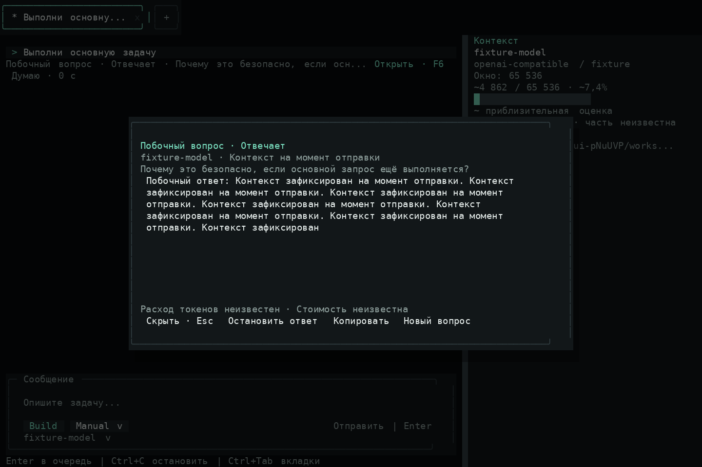

# P1.4: model port и /btw

База реализации: main `55feb46b29370b2f01c6c863c50b5f2ee23b5b62`, package 0.6.18. Это продолжение уже опубликованного P1.3/Auto LSP. Работа выполнена непосредственно в main; новые branches, worktrees и PR не создавались. Выпуск v0.6.19 добавлен по отдельному поручению владельца.

## Поведение

`builtin.btw` регистрирует `/btw <вопрос>` через обычный contribution API. Foreground остаётся в своей очереди, side_query получает отдельную operation и ограниченный model-only context без tools port. Обычная foreground extension invocation также имеет ленивый model port; команды без model calls по-прежнему не требуют API-ключа.

Контекст и выбранные profile/model/endpoint фиксируются при submit. Core bridge читает живую Session, включая уже принятый prompt до первого model response; незавершённые protocol blocks не передаются. Поздняя allocation закрытого разговора не заменяет новый owner. Сеть не держит workspace lease и не создаёт MCP binding или второй AgentRuntime.

Плавающее окно принадлежит исходному разговору: Esc/«Скрыть» скрывают представление, F6/«Открыть» возвращают его (также Tab → focus записи → Enter), «Остановить ответ» отменяет только побочный запрос. Ctrl+C сохраняет отмену foreground и её очереди. Черновик нового вопроса, cursor/selection и scroll принадлежат side presentation. Foreground approval временно получает единственного keyboard owner, пока side request продолжает работу. Ответ не добавляется в main messages, compaction или context occupancy.

## Ограничения и сохранение

Лимиты: вопрос 8 KiB UTF-8, snapshot 64 KiB, input 16 000 estimated tokens, output 2 048 tokens и 64 KiB, общий deadline 120 s, один активный request на conversation и четыре на приложение. Известные model limits дополнительно уменьшают бюджет. Неизвестные limits/pricing/usage остаются неизвестными.

SDK retries и compatibility fallback для completion отключены. Core делает максимум три completion HTTP attempts, только после явного 429/5xx до текста; после text delta/неизвестного исхода автоматического повтора нет. Native count_tokens выполняется с собственным существующим bounded transport без SDK retries. Timeout, ручная отмена, refusal, empty/missing/duplicate terminal, предложенный tool и обрезка имеют разные честные outcomes. Split-delta credentials проходят bounded holdback sanitizer до observers/UI/persistence.

Session schemaVersion остаётся 3: optional typed sideQueries/mainSpend/sideQuerySpend читаются старым migration/validation path. Main save под существующим index lock объединяет свежие side fields; side patch меняет только одну operation и accounting. Старый полный main snapshot не стирает ответ или расход. Accounting присваивается по operationId и пересчитывается из main subtotal + side ledger, а не прибавляется повторно. Resume превращает незавершённые side records в interrupted без auto-open или replay.

Сохраняются последние 50 terminal текстовых records и все активные records. Компактные expense entries старых operations остаются в ledger для aggregate расходов и idempotent late usage. Полный snapshot разговора не дублируется в side record. UI feedback при persistence failure явно сообщает, что ответ пока доступен только в текущем окне.

Trusted linked JavaScript остаётся in-process кодом, а не sandbox. Игнорирующий cancellation callback нельзя принудительно остановить средствами readonly API; core fences поздний текст и освобождает owner по deadline, реальный SDK получает abort. Late observed usage обновляет только original operation accounting. Это не subagent, jobs, UI slots или внешний SDK.

## Проверки

Linux, Bun 1.4.2, Node 24.19.0, package/compiled CLI 0.6.18 и финальные release builds 0.6.19:

| Команда | Результат |
| --- | --- |
| `bun run typecheck` | passed |
| `bun test` | 1056 passed, 1 existing native OS clipboard skip, 0 failed; 117 files |
| `bun run lint` | passed |
| `bun run eval --category all` | все 14 deterministic scenarios passed |
| `bun run build` | passed; actual default consumer включён в bundle |
| `bun run compile` и `dist/chisel --version` | passed, 0.6.19 |
| `bun run opentui:compile` / `dist/opentui-spike --smoke` | native OpenTUI и 10 000-entry scrollback passed |
| `bun tests/fixtures/command-packaging.ts` | installed + compiled real TUI command, /btw и LSP Settings scenarios passed |
| Обычные `npm pack` / `npm install` (0.6.19) | --version/doctor, manifest → model, LSP → model и /btw через настоящий installed cli.js passed |
| `side-query-cli.ts` с обычным compiled CLI | real OpenAI/Anthropic-compatible drivers, no-auth custom providers, three actual HTTP attempts, auth/protocol/partial/tool/oversize cases passed |
| `manifest-cli.ts` / `lsp-cli.ts` с compiled CLI | passed; real TypeScript и Python backends |

Real LSP regression использует внешний typescript-language-server 6.0.1 / TypeScript 6.0.3 и Pyright 1.1.414, Node 24.19.0; dev TypeScript ChiselCode не подставляется вместо backend. Обычный package installation не включает fixture autoload или production test flags.

Controlled real TUI acceptance удерживает основной HTTP request на barrier. Побочный request выдаёт текст до release foreground, продолжает и сохраняется во время write_file approval. Approval preempts window, deny возвращает side view, основной agent продолжает свой tool loop. Проверены одна Session allocation, два независимых streams, пустой side tools набор, totals без удвоения, hide/reopen без сети, отдельный draft, resize и resume. CLI acceptance использует оба реальных SDK drivers и локальный endpoint; платная модель не требуется.

## Реальные кадры

Кадры получены `captureCharFrame()` и `captureSpans()` установленного OpenTUI 0.5.12; PNG растеризует те же terminal cells/RGBA spans. Исходные TXT/JSON сохранены рядом, это не browser mock или imagegen. Interaction/capture tests проверяют 120×40, 100×30, 80×24, 60×20, 40×12, 24×8; Obsidian/Paper, ASCII/Unicode; receiving/completed, partial error, focused action, draft, hidden, scrolled-away/new text и approval.

[Paper / ASCII](assets/btw/completed-paper.png) · [24×8](assets/btw/tiny-24x8.png) · [Approval](assets/btw/approval.png) · [Новый вопрос](assets/btw/draft.png) · [Keyboard focus записи](assets/btw/keyboard-record.png)

Окно использует existing Palette/Dialog/Markdown/Scrollbox/clipboard: bounded 76×20, near-fullscreen tiny layout, footer вне scroll, focus marker и слова статуса вместо color-only indication. Использованы [OpenTUI Interaction](https://opentui.com/docs/core-concepts/interaction/), [Layout](https://opentui.com/docs/core-concepts/layout/) и installed source API; библиотека/темы не обновлялись. Реальные кадры вручную просмотрены: body/footer не перекрываются, tiny reading body и keyboard actions достижимы, Paper сохраняет читаемость. `/help` не возвращён; home hotkeys сохранены.
