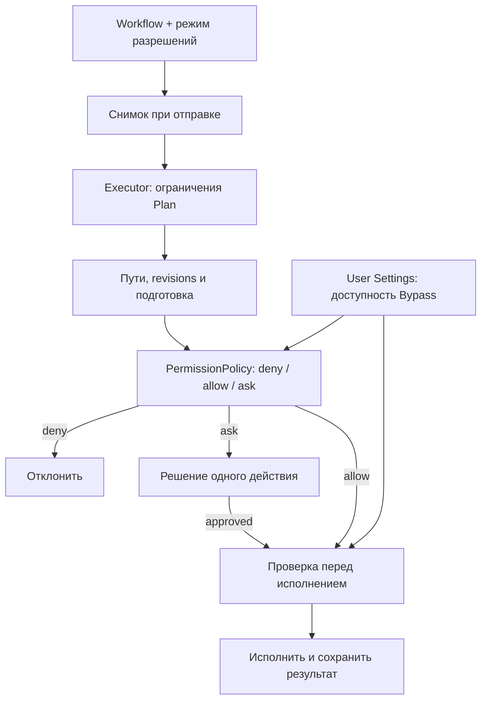

# Режимы разрешений

[Документация](README.md) · [Plan / Build](agent-modes.md) · [Безопасность](security.md)

Метка рядом с Plan/Build показывает текущий режим разрешений. Нажмите её или выполните `/permissions`, чтобы открыть popup с описаниями. F4 переключает доступные режимы для следующего запроса; Shift+Tab отдельно переключает Plan/Build. Модель и черновик сохраняются.

| Режим | ID для CLI и команд | Поведение в Build |
| --- | --- | --- |
| Manual | `default` | Чтение и явно разрешённые действия выполняются сразу. Другие действия требуют подтверждения |
| Accept edits | `acceptEdits` | Правки файлов проекта разрешены. Shell, Git commit и создание скиллов вне проекта требуют подтверждения, кроме явных allow rules |
| Dont ask | `dontAsk` | Только чтение и явно разрешённые действия. Всё остальное отклоняется без диалога и без ожидания интерактивного resume |
| Bypass | `bypassPermissions` | Действия выполняются без запросов разрешения. Доступен только после включения в пользовательских Settings |

По умолчанию выбран Manual. В Plan любой режим разрешений допускает только инструменты чтения. `deniedCommands`, границы файловых инструментов, проверка актуальности прочитанного файла, валидация patch и аргументов сохраняются во всех режимах. Bypass не является системной песочницей: shell работает с правами процесса и может обращаться за пределы проекта.

Подтверждение показывает команду или все diffs атомарной операции и разрешает действие **один раз**. Y/Н разрешает; N/Т/Esc и нажатие вне окна отклоняют. Предпросмотр прокручивается мышью, стрелками, PgUp/PgDn, Home/End. Следующая операция снова проверяется по правилам. Запрос разрешения имеет приоритет над другими popup и переживает пересоздание экрана.

## Доступ к Bypass

Откройте **Settings → Разрешения → Разрешить Bypass**. Переключатель сохраняется сразу; включение добавляет Bypass в popup и цикл F4, сохраняя текущий режим. После этого Bypass нужно выбрать отдельно. Выключение убирает его из выбора и переводит выбравшие его вкладки и очередь в Manual.

Настройка находится только в пользовательском `config.json`:

```json
{
  "schemaVersion": 2,
  "profiles": {},
  "permissions": {
    "allowBypassPermissions": false
  }
}
```

Отсутствие поля означает `false`. `.chiselrc`, скилл, его `allowed-tools`, ответ модели, сохранённый `approvalMode` и флаг `--yes` не включают эту возможность. Ошибка сохранения не меняет переключатель. Settings не закрывается во время записи настройки.

Проверка есть и в runtime: при выключенном доступе явный `--approval bypassPermissions` сообщает, где включить настройку, а возобновлённая Bypass-сессия начинает в Manual. Активный запрос получает живую проверку доступности. После выключения следующие действия проходят Manual-проверку; если доступ отозван между подготовкой и исполнением действия, оно отклоняется. Уже начатый внешний процесс или выполненная правка не откатываются автоматически.

## Команды, CLI и совместимость

`/permissions` открывает меню локально, без обращения к модели или создания сессии. `/permissions <ID>` выбирает режим. `manual` и старый `ask` — алиасы `default`; `/ask` выбирает Manual. Старый `auto`, `/auto`, `--yes` и `.chiselrc.autoApprove: true` теперь означают **Accept edits**: они не открывают Bypass и не разрешают любые команды.

```bash
chisel --approval default
chisel --mode build --approval acceptEdits "Выполни задачу"
chisel --approval dontAsk --allow write_file,edit_file "Исправь файл"
chisel --resume <session-id> --approval default
# Только при включённом доступе в пользовательских Settings:
chisel --approval bypassPermissions "Выполни задачу"
```

Приоритет: явный `--approval` → `--yes` → сохранённый режим сессии → `.chiselrc.autoApprove` → `default`. Узкие `--allow` и `allowedCommands` сохраняются; `deniedCommands` имеют приоритет над разрешением любого режима. Prefix allow rule действует только для простой shell-команды, без operators, redirection и неизвестных expansions.

Схема сессии принимает старые `ask/auto` и преобразует их в `default/acceptEdits`, включая `runtime.turnApprovalMode`; разговор и исходный файл при чтении не переписываются. После сохранения используются новые ID. Старый режим Auto не мигрирует в Bypass.

В неинтерактивном Manual или Accept edits действие, требующее подтверждения, сохраняет pending checkpoint и возвращает `APPROVAL_UNAVAILABLE`, exit 2. В Dont ask такое действие получает `PERMISSION_DENIED` и модель может продолжить работу. Resume повторно проверяет pending action; завершённые и отклонённые вызовы не воспроизводятся.

## Архитектура

Workflow `AgentMode` и permissions `ApprovalMode` остаются независимыми. `session.approvalMode` — выбор следующего запроса; `runtime.turnApprovalMode` — снимок текущего. Очередь фиксирует режим при отправке. Переключение F4 во время работы не расширяет разрешения текущего запроса, а выключение доступности Bypass отзывает её и для него.

`src/security/approval-mode.ts` содержит режимы, алиасы, описания и инструкции; `PermissionPolicy` решает `allow/ask/deny`. Accept edits основан на effect `workspace_write`, поэтому `process`, `git_write` и `external` не получают неявного разрешения. Compatibility gate также различает shell, Git и создание скиллов. `createLocalToolRuntime.getApprovalMode` проверяет доступность перед началом запроса; executor проверяет её при каждом действии и перед исполнением подготовленного Bypass-действия.



Настройка доступности хранится в глобальном config, а выбор режима — в metadata сессии под существующим lock. Записи Settings сериализуются с настройками темы и sidebar. При выключении доступности выбранные Bypass-вкладки и ожидающие запросы возвращаются в Manual. UI не исполняет инструменты и не выдаёт session-wide grants.

## Что изучено в Claude Code

Официальный Python Agent SDK перечисляет `default`, `acceptEdits`, `plan`, `bypassPermissions`, `dontAsk` и `auto`. Changelog описывает Manual как подпись `default`, Shift+Tab, сохранение режимов при resume, запрет Bypass через пользовательскую/управляемую политику и проверки реального пути symlink. SDK отдельно подтверждает, что Bypass сохраняет explicit deny rules.

| Claude Code | Решение ChiselCode |
| --- | --- |
| Manual / `default` | Manual с одноразовыми подтверждениями |
| `acceptEdits` | Автоматические правки проекта; прочие effects проверяются отдельно |
| `dontAsk` | Заранее разрешённые действия выполняются, остальные отклоняются без диалога |
| `bypassPermissions` | Отдельный режим с пользовательским opt-in в Settings и проверкой в runtime |
| `plan` | Уже реализованный независимый Plan, ограниченный executor |
| `auto` | В Claude это отдельный AI-классификатор, оценивающий каждый вызов. В ChiselCode такой классификатор не реализован, поэтому обычное разрешение всех действий не называется Auto |

Сравнение выполнено по официальным исходникам на 1 октября 2026 года. Страницы code.claude.com в этом окружении возвращали HTTP 403; семантика проверена по доступным первичным источникам:

- [Claude Agent SDK: PermissionMode и описание permission_mode](https://github.com/anthropics/claude-agent-sdk-python/blob/main/src/claude_agent_sdk/types.py).
- [Claude Agent SDK: acceptEdits и правила allowlist](https://github.com/anthropics/claude-agent-sdk-python/blob/main/README.md).
- [Claude Code: официальный changelog](https://github.com/anthropics/claude-code/blob/main/CHANGELOG.md).
- [Документация Claude Code permissions](https://code.claude.com/docs/en/permissions).

## Проверки

Проверяются матрица effects, allow/deny и составные shell-команды, отсутствие resolver в Dont ask, границы путей и freshness в Accept edits и Bypass, Plan во всех режимах, отключение Bypass до исполнения, наследование и migration сессий, сохранение и отказ записи пользовательской настройки. Native OpenTUI проверяет popup, F4, команды, Settings, черновик, модель, focus и приоритет подтверждения при 40×12, 80×24 и 120×36. Интеграционные сценарии покрывают очередь и независимость вкладок. Механика проверяется без платных запросов к модели.
