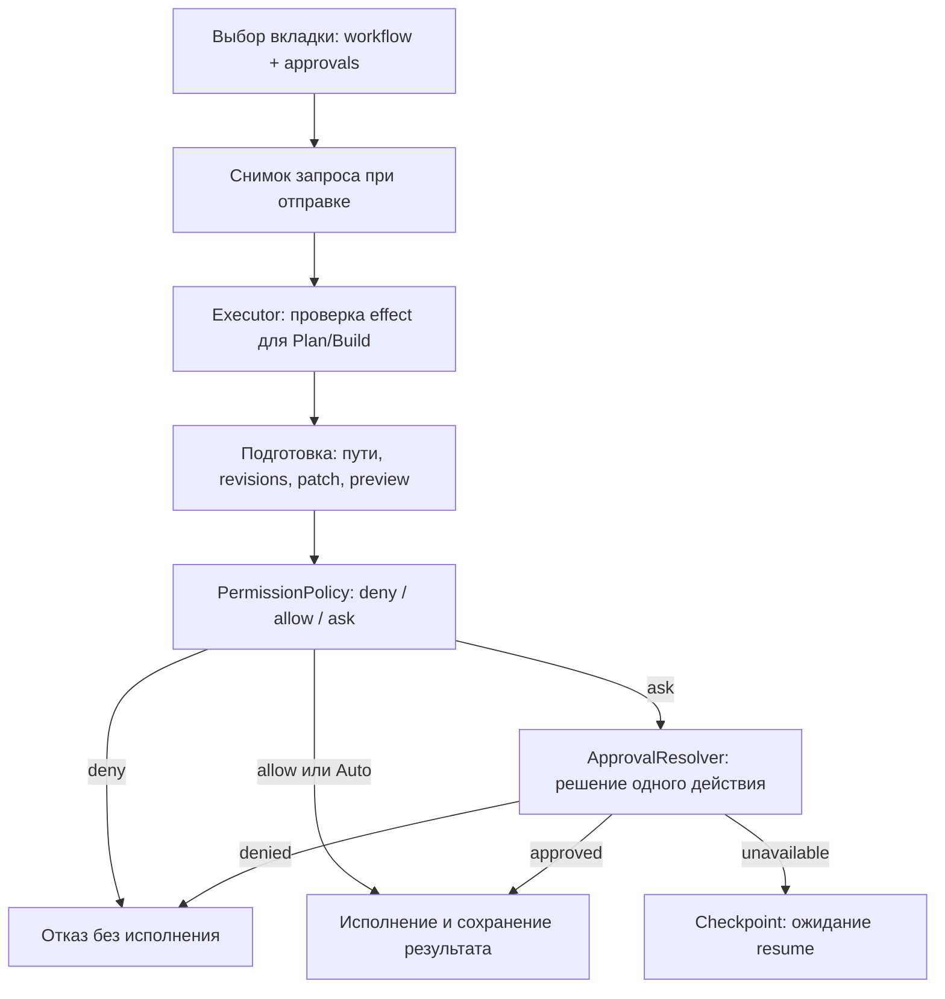

# С подтверждением / Авто

[Документация](README.md) · [Plan / Build](agent-modes.md) · [Безопасность](security.md)

Рядом с Plan/Build в поле ввода находятся две кнопки: **С подтверждением** и **Авто**. Нажмите нужную кнопку или F4 для выбора порядка разрешений следующего запроса. Shift+Tab отдельно переключает Plan/Build. Модель показана следующей строкой, чтобы название и переключатели помещались в компактном терминале.

По умолчанию используется «С подтверждением». Чтение проходит без диалога; изменение файлов, shell, Git commit и создание скиллов требуют разрешения, если действие заранее не разрешено через `--allow` или `allowedCommands`. Попап показывает команду или diff и позволяет разрешить действие **один раз** либо отклонить. Y/Н разрешает, N/Т/Esc и нажатие вне окна отклоняют. Предпросмотр листается колесом, стрелками, PgUp/PgDn, Home/End. Следующая операция снова проверяется по правилам.

В «Авто» приложение разрешает обычные действия без диалогов. Агент продолжает уточнять существенную неопределённость самой задачи. Авто сохраняет запреты команд, проверки путей, актуальности прочитанного файла, корректности patch и ограничения Plan.

| Workflow | С подтверждением | Авто |
| --- | --- | --- |
| Plan | Только инструменты чтения | Только инструменты чтения |
| Build | Обычные инструменты; изменения требуют решения, кроме явных allow rules | Обычные инструменты без диалогов; deny rules и проверки сохраняются |

Сам переход в Build не включает Авто. Скилл, его `allowed-tools`, ответ модели и просьба «игнорировать разрешения» не меняют выбранные режимы. Внутри попапа F4 и Shift+Tab не меняют разрешения агента.

## Команды, CLI и сохранение

`/auto`, `/ask` и `/permissions ask|auto` выбирают режим локально, без запроса к модели или создания вкладки. `/permissions` без аргумента показывает пояснение. Команды доступны в автодополнении и `/help`.

```bash
chisel --approval ask
chisel --mode build --approval auto "Выполни задачу и проверь результат"
chisel --resume <session-id> --approval ask
```

`--yes` совместим и выбирает Авто. Приоритет: явный `--approval` → `--yes` → сохранённый выбор сессии → `.chiselrc.autoApprove` → `ask`. Явный Ask заменяет широкое автоматическое разрешение, даже при `--yes` или `autoApprove: true`. Точечные `--allow` и `allowedCommands` продолжают работать. `deniedCommands` имеют приоритет над любым разрешением. Prefix allow rule разрешает только простую shell-команду; операторы, redirection и expansions требуют общего разрешения или решения пользователя.

Обе настройки принадлежат вкладке. «+» наследует выбранные режимы для нового разговора; существующие вкладки сохраняют собственный выбор. Resume восстанавливает сохранённые значения. Старые сессии без `approvalMode` используют прежний default проекта; чтение старого файла не переписывает его.

Сообщение захватывает оба режима при отправке, включая очередь. F4 во время работы выбирает разрешения следующего сообщения; текущий запрос продолжает работать с прежними. При отличии выбора подпись показывает режим выполняющегося запроса. Изменение выбора сохраняется после завершения работы без перезаписи истории устаревшей копией.

В одноразовом запуске Ask без доступного подтверждения возвращает `approval_required`, код завершения 2. Явный resume с Авто повторно проверяет pending action и может выполнить его. Завершённые или отклонённые invocation автоматически не воспроизводятся; после отказа нужен новый вызов. JSON содержит `approvalMode`: `ask` или `auto`.

## Архитектурное решение

Подтверждение имеет приоритет над настройками, скиллами и выбором сессий: фоновый запрос разрешения не скрывается за другим окном. Для атомарного patch передаются все diffs; окно показывает число файлов и весь прокручиваемый набор, включая изменения длиннее 200 строк. Одно решение относится ко всему подготовленному действию.

Workflow `AgentMode` и порядок подтверждений `ApprovalMode` — разные оси. Политика разрешений единая: UI не исполняет инструменты и не выдаёт обходных разрешений. `src/security/approval-mode.ts` содержит тип, default, разрешение приоритетов и инструкции. `PermissionPolicy` выдаёт `allow`, `ask` или `deny`: Auto разрешает обычные действия, которые иначе требовали бы подтверждения; явный deny остаётся отказом.



`session.approvalMode` хранит выбор; `runtime.turnApprovalMode` фиксирует выполняющийся запрос. TUI использует `approvalMode` и `runningApprovalMode` контроллера, очередь сохраняет оба режима при отправке. Runtime добавляет инструкции политики при каждом построении контекста, включая compaction. Local runtime передаёт зафиксированный выбор в executor; compatibility adapter получает его через `getApprovalMode`.

`ProjectSessionStore.setExecutionModes` обновляет только metadata под тем же lock, что checkpoints. Схема v3 проверяет enum и сохраняет runtime/историю; у legacy approvalMode нет принудительного schema default, иначе старый `autoApprove` потерялся бы. После выполнения приложение сохраняет выбранный enum.

Реализовано детерминированное автоматическое разрешение, как Auto в OpenCode. Отдельный анализатор намерений и системная песочница не добавляются. `run_shell` работает с правами процесса и может обращаться за пределы рабочей папки. Workspace checks защищают файловые инструменты и shell cwd, но не изолируют процесс shell. Границы описаны в [модели безопасности](security.md).

## Изученные источники

Сопоставление основано на доступных официальных источниках на 1 октября 2026 года. Возможности upstream не объявляются реализованными в ChiselCode.

| Проект | Наблюдаемая модель | Решение для ChiselCode |
| --- | --- | --- |
| OpenCode | `allow/ask/deny`; `--auto` разрешает запросы, кроме explicit deny. Auto отображается рядом с агентом; approval предлагает once/always/reject | Авто отдельно от workflow, deny имеет приоритет. Попап разрешает только один раз; постоянные grants задаются правилами |
| Codex | `AskForApproval` отдельно от `SandboxPolicy`. `Never` не эскалирует ошибки через approval; сам по себе не снимает sandbox restrictions | Разделить взаимодействие и допустимые действия. Наш Auto автоматически разрешает обычные действия, семантика отличается от Codex Never |
| Claude Code | Changelog описывает Auto с отдельной проверкой безопасности, отличает его от bypass, исправляет stale permission mode, resume и symlink restrictions | Захват политики на запрос, проверки resume/queue и файлов. Классификатор Claude Auto в ChiselCode не воспроизводится |
| OpenTUI | Native textarea, keyboard hooks с modifiers и bounded scrollbox | F4 не конфликтует с редактированием; две кнопки рядом с workflow, отдельная строка модели, общий popup с мышью и клавиатурой |

Источники:

- [OpenCode permissions](https://github.com/anomalyco/opencode/blob/dev/packages/web/src/content/docs/permissions.mdx).
- [Codex protocol: AskForApproval и SandboxPolicy](https://github.com/openai/codex/blob/main/codex-rs/protocol/src/protocol.rs).
- [Claude Code: официальный changelog](https://github.com/anthropics/claude-code/blob/main/CHANGELOG.md). Полные страницы документации в окружении возвращали HTTP 403; сравнение ограничено подтверждёнными сведениями changelog.
- [OpenTUI React](https://github.com/anomalyco/opentui/blob/main/packages/react/README.md), [textarea](https://github.com/anomalyco/opentui/blob/main/packages/core/src/renderables/Textarea.ts).

## Проверки

Тесты проверяют приоритеты и legacy defaults, narrow grants и hard denies, Auto без resolver, одноразовый Ask и отказ, path/freshness/Plan restrictions, неизменность политики после выбора другого режима и загрузки скилла, emergency compaction, pending resume без replay, enum и metadata без потери истории. Native OpenTUI проверяет F4 и мышь, черновик/модель/фокус, команды, вкладки, очередь и popup dismissal/scrolling при 40×12, 80×24 и 120×36. Проверки механики выполняются без платной модели.
