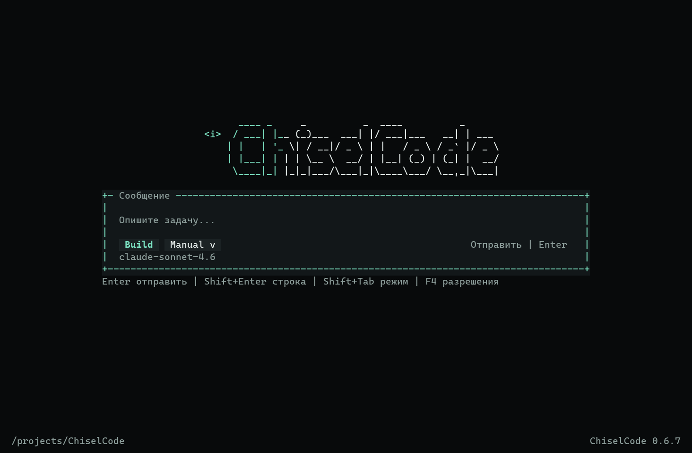
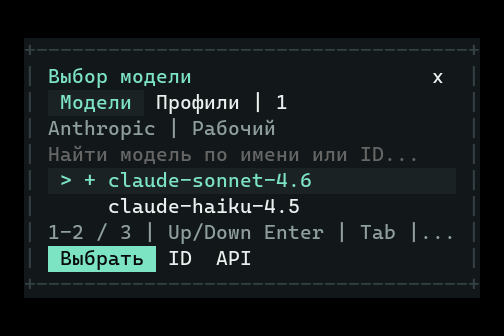
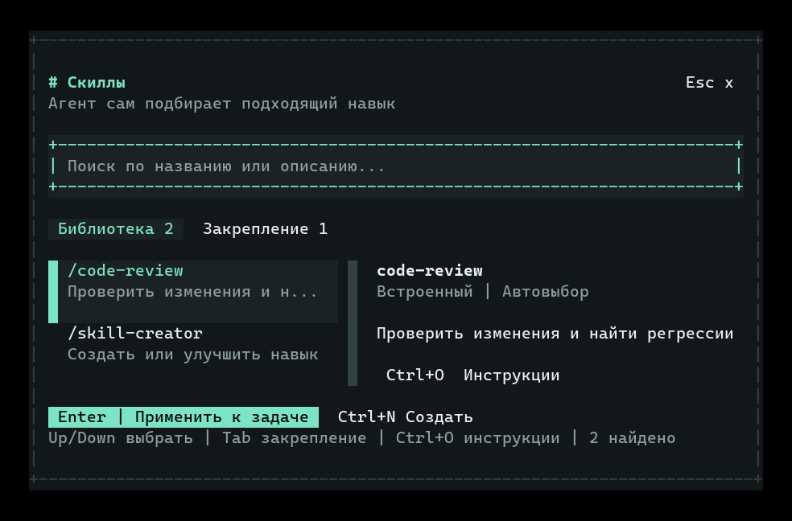

# Проверка значков терминала

Проверка от 1 октября 2026 года для изменений в `main`, без выпуска новой версии.
Пользователь сообщил о квадратах с вопросительным знаком в Windows Terminal.
Первичная проверка проведена с обычным Cascadia Mono, стандартной гарнитурой
Windows Terminal. По уточнению пользователя решение расширено: совместимое
ASCII-оформление включено по умолчанию и не зависит от графических глифов шрифта.

## Причины и исправления

Квадрат вместо значка возникает, когда шрифт не содержит нужного глифа, а
подстановка другого шрифта не срабатывает. Отдельная причина знаков замены —
разрезание суррогатной пары при `slice()` строки JavaScript. Эти проблемы
проверялись независимо.

В таблице `cmap` Cascadia Mono 2407.024 отсутствовали десять символов из исходников:

| Раньше | Unicode | Использование | Теперь |
| --- | --- | --- | --- |
| `✗` | U+2717 | Ошибка, проверка подключения, CLI | `x` и красный цвет |
| `⚠` | U+26A0 | Предупреждения | `!` и поясняющий текст |
| `ℹ` | U+2139 | Метка информации | `i` |
| `✦` | U+2726 | Заголовок библиотеки скиллов | `#` |
| `✧` | U+2727 | Поиск файлов, загрузка скилла | `*` / `#` |
| `⌕` | U+2315 | Поиск по коду | `/` |
| `⇪` | U+21EA | Обновление приложения | `^` |
| `↵` | U+21B5 | Отправка и подсказка Enter | `Enter` |
| `⚙` | U+2699 | Настройки в узком выборе модели | `API` |
| `↻` | U+21BB | Подсказка обновления каталога | `обн.` |

Все служебные значки переведены в ASCII: выбор `>`, успешный статус `+`, ошибка
`x`, раскрытие `v`, закрытие `x`, разделитель `|`. Обозначения объединены в
`src/ui/theme.ts` и используются также в одноразовом CLI. Неизвестный инструмент
получает нейтральную метку `:`, сохраняя своё имя.

В совместимом оформлении рамки состоят из `+`, `-`, `|`, главный экран использует
отдельный ASCII-логотип. Нативный ползунок OpenTUI рисовал `█▀▄`, отсутствующие
в Noto Mono. В совместимом режиме используются нативные ASCII-кнопки прокрутки:
`^`, `v`, `<`, `>`. Колесо, клавиши и нажатия стрелок работают; блочный ползунок
остаётся в графическом оформлении.

В `/settings` → «Оформление» добавлен переключатель «Графика», доступный также
через `Ctrl+G` внутри этого раздела. Он возвращает исходный логотип Coder Mini,
округлые рамки и нативный ползунок, если шрифт поддерживает графические символы.
Цвета и композиция экранов сохраняются в обоих оформлениях. Настройка
`ui.unicodeDecorations` сохраняется сразу, по умолчанию `false`; она переживает
смену вкладок. Ошибка сохранения оставляет прежнее оформление и черновик.

`src/ui/terminal-text.ts` разделяет ограничение объёма текста и ширины строки:

- `clipText()` из `src/utils/text.ts` ограничивает UTF-16, сохраняя целые графемы: emoji, флаги,
  последовательности с ZWJ и буквы с комбинируемыми знаками.
- `terminalSafeText()` удаляет терминальные команды перед обрезкой, нормализует
  CRLF, очищает C0/C1 и заменяет непарные суррогаты безопасным ASCII `?`.
- `terminalLine()` обрезает подписи по клеткам терминала, добавляя ASCII `...`.
  Используется для модели, вкладок, списка скиллов, настроек и контекста.

Первый цикл регрессионных тестов обнаружил, что `node:util` в используемом Bun
оставлял часть OSC-заголовка, содержащего пробелы, обычным текстом. OSC с BEL,
ST, C1 и незавершённым окончанием теперь удаляется отдельно перед основной очисткой.
Переименование и поиск сессий поддерживают вставку Unicode; Backspace удаляет
графему целиком. Ограничения сохраняемых названий и индексных превью также
соблюдают границы графем. Исходные ответы и патчи не меняются ради отображения.
Unicode в ответах, именах файлов и введённом тексте сохраняется. API-ключ остаётся
только в закрытом буфере, экран получает ASCII-маску `*`.

## Проверки

Проверки выполнялись после исправлений и повторялись при обнаруженных дефектах:

| Проверка | Результат |
| --- | --- |
| Все unit/integration-тесты | 403 прошли, 0 ошибок; 51 файл |
| Сценарии агента | 7 из 7 |
| TypeScript и Biome | Без ошибок |
| Нативные кадры OpenTUI | 408 кадров: 17 состояний × 3 размера × 4 темы × 2 оформления |
| Служебные графические глифы в совместимом оформлении | Отсутствуют: ASCII и кириллица, без box drawing, emoji и блоков |
| Все символы 204 совместимых кадров против шрифтов | 127 из 127 поддерживаются во всех шести проверенных семействах |
| Графическое оформление | 204 кадра; все глифы есть в Cascadia Mono и DejaVu Sans Mono |
| Повреждённый Unicode и старые неподдерживаемые значки в кадрах | Не обнаружены |
| Маска ключа в настройках | Тестовый ключ не попадает в кадры |
| Пакет и нативный CLI | Собраны; `--version` остаётся `0.6.7` |
| Нативный OpenTUI smoke | Пройден, включая историю из 10 000 записей / 157 коммитов renderer |

Размеры: 40×12, 80×24 и 120×36. Темы: Obsidian, Graphite, Ember и Paper.
Проверенные шрифты: Cascadia Mono, DejaVu Sans Mono, Liberation Mono,
Nimbus Mono PS, Noto Mono и Noto Sans Mono.
Состояния: главная, Plan, чат с инструментами/ошибкой/предупреждением, скиллы,
закрепление скиллов, подключение, ошибка проверки подключения, ввод ключа,
оформление, настройка разрешений с Bypass выключенным/включённым, выбор модели,
ошибка каталога, ручной ID, окно разрешений, подтверждение команды и diff.

Регрессионные тесты перебирают границы обрезки для кириллицы, emoji, флагов,
ZWJ, combining marks и CJK, проверяют ширину клеток, управляющие последовательности,
длинные строки diff, поиск/переименование и клик по кнопке отправки после resize.
Отдельно проверяются ASCII-символы при длинной истории, прокрутка мышью,
сохранение пользовательского Unicode и переключение ползунка без пересоздания
viewport или сброса позиции.

Это проверка кода, нативного renderer и покрытия шрифта, а не снимок физического
Windows Terminal пользователя. Сам terminal renderer не сообщает, какой шрифт
в данный момент выбран и сработала ли подстановка глифа. Для произвольной
гарнитуры, не отображающей даже обычные ASCII/кириллические буквы, или уже
повреждённого текста от внешней команды результат нельзя выдать за проверенный.
Графическое оформление включается отдельно именно из-за различий шрифтов.
Матрица физических терминалов остаётся
[отдельной проверкой](opentui-terminal-matrix.md).

## Превью

Кадры настоящих компонентов OpenTUI отрисованы с проверенным Cascadia Mono:







## Источники и воспроизводимость

- [Microsoft: внешний вид Windows Terminal и стандартный Cascadia Mono](https://learn.microsoft.com/en-us/windows/terminal/customize-settings/profile-appearance).
- [Microsoft Cascadia Code: различия Mono, PL и NF](https://github.com/microsoft/cascadia-code/blob/main/README.md).
- [Unicode: неподдерживаемые символы и missing glyph](https://www.unicode.org/faq/unsup_char.html).
- [Unicode UAX #29: границы графем](https://www.unicode.org/reports/tr29/).
- [Unicode UAX #11: ширина и особенности терминалов](https://www.unicode.org/reports/tr11/).
- [OpenTUI TextBuffer](https://github.com/anomalyco/opentui/blob/main/packages/core/src/text-buffer.ts) и
  [Box / оформление рамок](https://github.com/anomalyco/opentui/blob/main/packages/core/src/renderables/Box.ts).

Проверенный шрифт: [CascadiaMono[wght].ttf из Google Fonts](https://github.com/google/fonts/blob/main/ofl/cascadiamono/CascadiaMono%5Bwght%5D.ttf),
имя `Cascadia Mono`, версия `2407.024`, SHA-256
`78864a1b4d03767a44731454a6f24c6b7d6e93fb5f62932860eb02e409cd50cb`.
Для проверки таблицы символов использовался `fontTools.ttLib.TTFont(...).getBestCmap()`;
бинарный файл шрифта не включён в приложение.

Основные проверки проекта:

```sh
bun test
bun run typecheck
bun run lint
bun run eval --category all
bun run build
bun run compile
bun run opentui:compile
./dist/opentui-spike --smoke
```

Новый релиз, тег и изменения версии для этой задачи не создаются.
